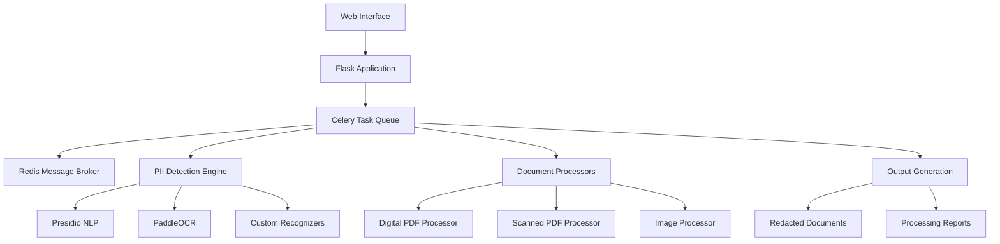

# 🔒 Redactify - Intelligent PII Redaction System

<div align="center">


**🎯 Enterprise-grade automated PII detection and redaction for documents and images**
**🚀 Powered by AI, Built for Scale, Designed for Security**

[📖 Documentation](#-documentation) • [⚡ Quick Start](#-quick-start) • [🔧 Installation](#-installation) • [🌟 Features](#-features) • [📊 API Reference](#-api-usage)

</div>

---

## 🌟 Overview

**Redactify** is a cutting-edge, production-ready system that automatically detects and redacts Personally Identifiable Information (PII) from PDF documents and images. Leveraging advanced machine learning, computer vision, and natural language processing, it provides comprehensive data protection across various document formats with enterprise-grade performance and security.

### 🎯 Industry Applications

| Industry | Use Cases | Compliance |
|----------|-----------|------------|
| 🏥 **Healthcare** | Medical records, patient charts, lab results | HIPAA, HITECH |
| 🏦 **Financial Services** | Bank statements, loan applications, credit reports | PCI-DSS, SOX, GDPR |
| ⚖️ **Legal** | Case files, contracts, discovery documents | Attorney-client privilege |
| 🏛️ **Government** | Classified documents, citizen records | FOIA, Privacy Act |
| 🏢 **HR & Recruiting** | Employee records, resumes, performance reviews | Employment law compliance |
| 🎓 **Education** | Student records, transcripts, applications | FERPA, COPPA |

### 🚀 Why Choose Redactify?

- **🧠 AI-Powered Accuracy** - 25+ PII types with 95%+ detection accuracy
- **⚡ Lightning Fast** - GPU acceleration for 10x faster processing
- **🔒 Enterprise Security** - Zero data retention, complete audit trails
- **🌐 Scalable Architecture** - Handles thousands of documents simultaneously
- **🎨 Beautiful Interface** - Intuitive web UI with real-time progress tracking
- **🔧 Developer Friendly** - RESTful API with comprehensive documentation

---

## ✨ Key Features

### 🔍 **Advanced PII Detection**

### 🔍 **Advanced PII Detection**

- **India-Specific Types** - Aadhaar, PAN Card, Passport, Voter ID (EPIC), optimized for Indian documents
- **Universal Types** - Names, emails, phone numbers, addresses, credit cards, bank accounts
- **International Types** - US SSN, UK NHS, IBAN, SWIFT codes, driver licenses
- **Specialized Types** - Medical licenses, exam IDs, IP addresses, dates, metadata
- **Context-aware Recognition** - Reduces false positives through intelligent context analysis
- **Custom Recognition Rules** - Define your own PII patterns and rules

### 📄 **Comprehensive Document Support**

- **Digital PDFs** - Text extraction and precise redaction
- **Scanned Documents** - OCR-powered text recognition
- **Images** - JPEG, PNG, TIFF, BMP support
- **Metadata Cleaning** - Removes hidden sensitive information

### 🚀 **Enterprise Architecture**

- **Asynchronous Processing** - Celery-based task queue for scalability
- **GPU Acceleration** - CUDA support for faster processing
- **RESTful API** - Easy integration with existing systems
- **Web Interface** - User-friendly upload and management portal
- **Docker Ready** - Containerized deployment options

### 🔐 **Security & Compliance**

- **QR Code/Barcode Detection** - Automatically redacts encoded information
- **Configurable Redaction** - Choose specific PII types to target
- **Audit Trails** - Complete processing logs
- **Secure File Handling** - Temporary file cleanup and secure storage

---

## 🏗️ System Architecture



### Core Components

1. **🌐 Web Layer** - Flask-based web application with intuitive UI
2. **⚡ Task Processing** - Celery workers for asynchronous document processing
3. **🧠 AI Engine** - Presidio + PaddleOCR + Custom recognizers
4. **📊 Storage Layer** - Redis for task management and result caching
5. **🔧 Processing Pipeline** - Modular processors for different document types

---

## 🚀 Quick Start

### Prerequisites

- **Python 3.10+** (3.11 recommended)
- **Redis Server** (6.0+)
- **Git**
- **4GB+ RAM** (8GB+ recommended)
- **NVIDIA GPU** (optional, for acceleration)

### Installation

```bash
# Clone repository
git clone https://github.com/yourusername/Redactify.git
cd Redactify

# Create virtual environment
python -m venv venv
source venv/bin/activate  # Windows: venv\Scripts\activate

# Install dependencies
pip install -r Redactify/requirements.txt

# For GPU acceleration (optional)
pip install -r Redactify/requirements_gpu.txt

# Download NLP models (choose one based on your needs)
python -m spacy download en_core_web_trf  # Best accuracy (transformer model)
python -m spacy download en_core_web_lg   # Good accuracy, faster
python -m spacy download en_core_web_md   # Balanced performance

# Start Redis server
sudo systemctl start redis  # Linux
brew services start redis   # macOS
# Windows: Download and install Redis

# Configure application (optional - defaults work)
cp config.yaml.template config.yaml  # If you need custom settings
nano config.yaml  # Edit as needed

# Run Redactify with all components
python Redactify/main.py

# Or run with specific options
python Redactify/main.py --host 0.0.0.0 --port 8080 --production
python Redactify/main.py --api-only  # API server only
python Redactify/main.py --disable-gpu  # Force CPU mode
```

### 🐳 Docker Quick Start

```bash
# CPU-only deployment
docker-compose -f docker/docker-compose.yml up -d

# GPU-accelerated deployment
docker-compose -f docker/docker-compose.yml -f docker/docker-compose.prod.yml up -d
```

---

## 📚 Documentation

| Document | Description |
|----------|-------------|
| [📖 Installation Guide](installation.md) | Comprehensive setup instructions for all environments |
| [⚡ Command Reference](command.md) | All available commands and usage examples |
| [🏗️ Architecture Guide](docs/architecture.md) | System design and component documentation |
| [🔧 Configuration Guide](docs/configuration.md) | Complete configuration reference |
| [🤖 API Documentation](docs/api.md) | REST API endpoints and examples |
| [🧪 Testing Guide](docs/testing.md) | Testing framework and best practices |

---

## 🎯 Usage Examples

### Web Interface

1. Navigate to `http://localhost:5000`
2. Upload your document (PDF/Image)
3. Select PII types to redact
4. Download the redacted document

### API Usage

```python
import requests

# Upload and process document
with open('document.pdf', 'rb') as f:
    response = requests.post(
        'http://localhost:5000/process',
        files={'file': f},
        data={
            'pii_types': ['PERSON', 'EMAIL_ADDRESS', 'PHONE_NUMBER', 'INDIA_AADHAAR_NUMBER'],
            'redact_metadata': 'true',
            'detect_qr_barcodes': 'true'
        }
    )

task_id = response.json()['task_id']

# Check processing status
status = requests.get(f'http://localhost:5000/task_status/{task_id}')
print(status.json())  # {'status': 'PENDING|RUNNING|SUCCESS|FAILURE', 'progress': 50}

# Get processing progress
progress = requests.get(f'http://localhost:5000/progress/{task_id}')

# Download redacted document (when complete)
if status.json()['status'] == 'SUCCESS':
    redacted_doc = requests.get(f'http://localhost:5000/result/{task_id}')
    with open('redacted_document.pdf', 'wb') as f:
        f.write(redacted_doc.content)

# Get preview/analysis results
preview = requests.get(f'http://localhost:5000/preview/{task_id}')
```

### Available PII Types

**Common Types (India-optimized):**

- `PERSON` - Person names
- `PHONE_NUMBER` - Phone numbers  
- `EMAIL_ADDRESS` - Email addresses
- `LOCATION` - Addresses and locations
- `INDIA_AADHAAR_NUMBER` - Aadhaar numbers
- `INDIA_PAN_NUMBER` - PAN card numbers
- `INDIA_PASSPORT` - Indian passport numbers
- `INDIA_VOTER_ID` - Voter ID (EPIC) numbers

**Advanced Types:**

- `CREDIT_CARD` - Credit card numbers
- `BANK_ACCOUNT` - Bank account numbers
- `US_SSN` - US Social Security numbers
- `DATE_TIME` - Dates and timestamps
- `IP_ADDRESS` - IP addresses
- `UK_NHS` - UK NHS numbers
- `IBAN_CODE` - International bank account numbers
- `SWIFT_CODE` - SWIFT codes

---

## 🛠️ Development

### Project Structure

```
Redactify/
├── main.py              # Application entry point with multi-process support
├── app.py               # Alternative entry point
├── core/                # Core configuration and PII type definitions
│   ├── config.py        # Modular configuration system
│   ├── analyzers.py     # PII detection engines (Presidio + Custom)
│   └── pii_types.py     # PII type definitions by category
├── processors/          # Document processing modules
│   ├── digital_pdf_processor.py    # Text-based PDF processing
│   ├── scanned_pdf_processor.py    # OCR-based PDF processing
│   ├── image_processor.py          # Image processing and OCR
│   ├── pdf_detector.py             # PDF type detection
│   ├── qr_code_processor.py        # QR/barcode detection
│   └── metadata_processor.py       # Document metadata cleaning
├── recognizers/         # Custom PII recognition logic
│   ├── custom_recognizers.py       # India-specific recognizers
│   └── entity_types.py             # Entity type definitions
├── services/           # Celery tasks and background services
│   ├── celery_service.py          # Celery configuration
│   ├── tasks.py                   # Background task definitions
│   ├── redaction.py               # Core redaction logic
│   └── cleanup.py                 # File cleanup services
├── web/               # Flask web application
│   ├── app_factory.py            # Flask app factory pattern
│   ├── routes.py                 # Web routes and API endpoints
│   └── forms.py                  # Form handling
├── utils/             # Utility functions and helpers
│   └── gpu_utils.py              # GPU acceleration utilities
└── templates/         # HTML templates for web interface
```

### Contributing

1. Fork the repository
2. Create a feature branch: `git checkout -b feature-name`
3. Make your changes and add tests
4. Run tests: `python -m pytest tests/`
5. Submit a pull request

---

## 🔧 Configuration

Key configuration options in `config.yaml`:

```yaml
# PII Detection Configuration
presidio_config:
  nlp_config:
    nlp_engine_name: spacy
    models: [{ "lang_code": "en", "model_name": "en_core_web_trf" }]
    labels_to_ignore: ["FAC", "ORG"]
  context_words:
    PERSON: ["name", "person", "mr", "mrs", "ms", "dr", "prof"]

# Detection Thresholds
presidio_confidence_threshold: 0.05  # Lower = more sensitive detection
ocr_confidence_threshold: 0.1        # Lower = more text detected

# File Storage
max_file_size_mb: 100
temp_file_max_age_seconds: 172800     # 2 days

# Task Processing
celery_task_soft_time_limit: 600      # 10 minutes
celery_task_hard_time_limit: 660      # 11 minutes

# Redis Connection
redis_url: redis://localhost:6379/0
```

---

## 🌐 Deployment Options

### Development

- **Single Process** - Flask development server with Celery workers
- **Multi-Process** - Separate processes for web and workers

### Production

- **Docker Compose** - Containerized multi-service deployment
- **Kubernetes** - Scalable orchestrated deployment
- **Cloud Platforms** - AWS, Azure, GCP ready

---

## 🔒 Security Considerations

- **File Isolation** - Temporary files are automatically cleaned up
- **Memory Management** - Configurable limits to prevent resource exhaustion
- **Access Control** - API authentication ready
- **Audit Logging** - Complete operation tracking
- **Data Encryption** - TLS/SSL ready for production

---

## 📊 Performance

| Document Type | Processing Speed | GPU Acceleration |
|---------------|------------------|------------------|
| Digital PDF | 2-5 pages/sec | 3-8 pages/sec |
| Scanned PDF | 1-2 pages/sec | 2-4 pages/sec |
| Images | 1-3 images/sec | 2-6 images/sec |

*Performance varies based on document complexity and hardware*

---

## 🤝 Support & Community

- **📧 Email Support** - [support@redactify.com](mailto:support@redactify.com)
- **🐛 Bug Reports** - [GitHub Issues](https://github.com/yourusername/Redactify/issues)
- **💬 Discussions** - [GitHub Discussions](https://github.com/yourusername/Redactify/discussions)
- **📖 Wiki** - [Project Wiki](https://github.com/yourusername/Redactify/wiki)

---

## 📄 License

This project is licensed under the MIT License - see the [LICENSE](LICENSE) file for details.

---

## 🙏 Acknowledgments

- **Microsoft Presidio** - PII detection framework
- **PaddlePaddle** - OCR capabilities
- **Flask & Celery** - Web framework and task processing
- **spaCy** - Natural language processing

---

<div align="center">

**Made with ❤️ by the Redactify Team**

[⭐ Star us on GitHub](https://github.com/yourusername/Redactify) | [🐛 Report Issues](https://github.com/yourusername/Redactify/issues) | [📖 Documentation](docs/)

</div>
