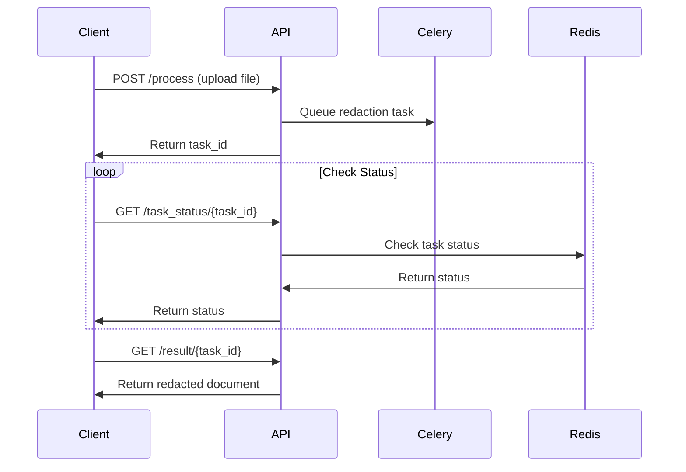

# 🚀 Redactify API Documentation

This document provides comprehensive API reference for integrating Redactify into your applications.

## Base URL

```
http://localhost:5000
```

## Content Types

All endpoints accept and return JSON unless otherwise specified. File uploads use `multipart/form-data`.

---

## 📋 Endpoints Overview

| Method | Endpoint | Description |
|--------|----------|-------------|
| `GET` | `/` | Web interface home page |
| `POST` | `/process` | Upload and process document |
| `GET` | `/task_status/<task_id>` | Get processing status |
| `GET` | `/progress/<task_id>` | Get detailed progress information |
| `GET` | `/result/<task_id>` | Download processed document |
| `GET` | `/preview/<task_id>` | Get processing preview/analysis |
| `POST` | `/cleanup` | Clean up temporary files |

---

## 🔄 Document Processing Workflow



---

## 📤 Upload and Process Document

### `POST /process`

Upload a document for PII redaction processing.

#### Request

**Headers:**

- `Content-Type: multipart/form-data`

**Form Data:**

| Parameter | Type | Required | Description |
|-----------|------|----------|-------------|
| `file` | File | ✅ | Document to process (PDF, JPEG, PNG, TIFF, BMP) |
| `pii_types` | Array | ✅ | List of PII types to detect (see [PII Types](#-available-pii-types)) |
| `redact_metadata` | Boolean | ❌ | Remove document metadata (default: false) |
| `detect_qr_barcodes` | Boolean | ❌ | Detect and redact QR codes/barcodes (default: false) |

#### Example Request

```python
import requests

files = {'file': open('document.pdf', 'rb')}
data = {
    'pii_types': ['PERSON', 'EMAIL_ADDRESS', 'INDIA_AADHAAR_NUMBER'],
    'redact_metadata': 'true',
    'detect_qr_barcodes': 'true'
}

response = requests.post('http://localhost:5000/process', files=files, data=data)
```

```bash
curl -X POST \
  -F "file=@document.pdf" \
  -F "pii_types=PERSON" \
  -F "pii_types=EMAIL_ADDRESS" \
  -F "redact_metadata=true" \
  http://localhost:5000/process
```

#### Response

```json
{
  "success": true,
  "task_id": "abc123def456",
  "message": "Document uploaded successfully. Processing started.",
  "filename": "document.pdf",
  "file_size": 1048576,
  "estimated_time": "2-5 minutes"
}
```

#### Error Response

```json
{
  "success": false,
  "error": "File type not supported",
  "details": "Only PDF and image files are allowed"
}
```

---

## 📊 Check Processing Status

### `GET /task_status/<task_id>`

Get the current status of a processing task.

#### Response

```json
{
  "status": "RUNNING",
  "progress": 65,
  "stage": "Analyzing PII patterns",
  "eta_seconds": 45,
  "result": null
}
```

#### Status Values

| Status | Description |
|--------|-------------|
| `PENDING` | Task queued, waiting to start |
| `RUNNING` | Task is currently processing |
| `SUCCESS` | Task completed successfully |
| `FAILURE` | Task failed with error |
| `RETRY` | Task is being retried |

---

## 📈 Get Detailed Progress

### `GET /progress/<task_id>`

Get detailed progress information including current processing stage.

#### Response

```json
{
  "task_id": "abc123def456",
  "status": "RUNNING",
  "progress_percentage": 65,
  "current_stage": "Analyzing PII patterns",
  "stages_completed": ["Document upload", "File validation", "Text extraction"],
  "stages_remaining": ["PII detection", "Redaction", "Document generation"],
  "estimated_completion": "2024-01-15T14:30:00Z",
  "processing_time_elapsed": 120,
  "file_info": {
    "filename": "document.pdf",
    "size_mb": 2.5,
    "pages": 10,
    "type": "digital_pdf"
  }
}
```

---

## 📥 Download Processed Document

### `GET /result/<task_id>`

Download the redacted document after processing is complete.

#### Response

Returns the redacted document file with appropriate Content-Type headers:

- `application/pdf` for PDF files
- `image/jpeg`, `image/png`, etc. for image files

#### Headers

```
Content-Type: application/pdf
Content-Disposition: attachment; filename="document_redacted.pdf"
Content-Length: 1048576
```

---

## 🔍 Get Processing Preview

### `GET /preview/<task_id>`

Get a preview of detected PII and processing results without downloading the full document.

#### Response

```json
{
  "task_id": "abc123def456",
  "status": "SUCCESS",
  "processing_summary": {
    "total_pii_found": 25,
    "pii_by_type": {
      "PERSON": 8,
      "EMAIL_ADDRESS": 5,
      "PHONE_NUMBER": 7,
      "INDIA_AADHAAR_NUMBER": 3,
      "LOCATION": 2
    },
    "pages_processed": 10,
    "processing_time": 185,
    "confidence_scores": {
      "average": 0.87,
      "min": 0.65,
      "max": 0.98
    }
  },
  "detected_entities": [
    {
      "type": "PERSON",
      "text": "John Doe",
      "confidence": 0.95,
      "page": 1,
      "location": {"x": 100, "y": 200, "width": 80, "height": 20}
    }
  ],
  "metadata_removed": true,
  "qr_codes_found": 2,
  "file_info": {
    "original_size_mb": 2.5,
    "redacted_size_mb": 2.3,
    "pages": 10
  }
}
```

---

## 🧹 Cleanup Resources

### `POST /cleanup`

Manually trigger cleanup of temporary files and processing artifacts.

#### Request

```json
{
  "task_ids": ["abc123def456", "xyz789abc123"],
  "force": false
}
```

#### Response

```json
{
  "success": true,
  "cleaned_tasks": ["abc123def456"],
  "files_removed": 8,
  "space_freed_mb": 25.6,
  "errors": []
}
```

---

## 🏷️ Available PII Types

### Common Types (India-optimized)

| PII Type | Description | Example |
|----------|-------------|---------|
| `PERSON` | Person names | John Smith, राम शर्मा |
| `EMAIL_ADDRESS` | Email addresses | <user@example.com> |
| `PHONE_NUMBER` | Phone numbers | +91-9876543210, (555) 123-4567 |
| `LOCATION` | Addresses and locations | 123 Main St, मुंबई |
| `INDIA_AADHAAR_NUMBER` | Aadhaar numbers | 1234 5678 9012 |
| `INDIA_PAN_NUMBER` | PAN card numbers | ABCDE1234F |
| `INDIA_PASSPORT` | Indian passport numbers | A1234567 |
| `INDIA_VOTER_ID` | Voter ID (EPIC) numbers | ABC1234567 |

### Advanced Types

| PII Type | Description | Example |
|----------|-------------|---------|
| `CREDIT_CARD` | Credit card numbers | 4111-1111-1111-1111 |
| `BANK_ACCOUNT` | Bank account numbers | 1234567890123456 |
| `US_SSN` | US Social Security numbers | 123-45-6789 |
| `DATE_TIME` | Dates and timestamps | 2024-01-15, 15/01/2024 |
| `IP_ADDRESS` | IP addresses | 192.168.1.1, 2001:db8::1 |
| `UK_NHS` | UK NHS numbers | 123 456 7890 |
| `IBAN_CODE` | International bank account numbers | GB82 WEST 1234 5698 7654 32 |
| `SWIFT_CODE` | SWIFT codes | ABCDUS33XXX |
| `NRP` | National registration/ID numbers | Various formats |
| `URL` | Website URLs | <https://example.com> |
| `MEDICAL_LICENSE` | Medical license numbers | MD123456 |
| `EXAM_IDENTIFIER` | Exam IDs & roll numbers | ROLL123456 |
| `DRIVING_LICENSE` | Driving license numbers | DL1234567890 |
| `US_DRIVER_LICENSE` | US driver license numbers | D123-456-789-012 |
| `US_ITIN` | US Individual Taxpayer ID | 9XX-XX-XXXX |
| `US_PASSPORT` | US passport numbers | 123456789 |
| `UK_PASSPORT` | UK passport numbers | 123456789 |
| `METADATA` | Document metadata & hidden content | Author, creation date, etc. |

---

## 🚨 Error Handling

### Common Error Responses

#### File Too Large

```json
{
  "success": false,
  "error": "File too large",
  "details": "Maximum file size is 100MB",
  "error_code": "FILE_TOO_LARGE",
  "max_size_mb": 100
}
```

#### Unsupported File Type

```json
{
  "success": false,
  "error": "Unsupported file type",
  "details": "Only PDF, JPEG, PNG, TIFF, and BMP files are supported",
  "error_code": "UNSUPPORTED_FILE_TYPE",
  "supported_types": ["pdf", "jpeg", "jpg", "png", "tiff", "tif", "bmp"]
}
```

#### Task Not Found

```json
{
  "success": false,
  "error": "Task not found",
  "details": "The specified task ID does not exist or has expired",
  "error_code": "TASK_NOT_FOUND",
  "task_id": "invalid_task_id"
}
```

#### Processing Failed

```json
{
  "success": false,
  "error": "Processing failed",
  "details": "Unable to extract text from document",
  "error_code": "PROCESSING_ERROR",
  "task_id": "abc123def456",
  "stage": "text_extraction"
}
```

### HTTP Status Codes

| Code | Description |
|------|-------------|
| `200` | Success |
| `202` | Accepted (task queued) |
| `400` | Bad Request (invalid parameters) |
| `404` | Not Found (task/file not found) |
| `413` | Payload Too Large (file too big) |
| `415` | Unsupported Media Type |
| `429` | Too Many Requests (rate limited) |
| `500` | Internal Server Error |

---

## 🔧 SDK Examples

### Python SDK

```python
import requests
import time
from typing import List, Optional

class RedactifyClient:
    def __init__(self, base_url: str = "http://localhost:5000"):
        self.base_url = base_url
    
    def process_document(self, 
                        file_path: str, 
                        pii_types: List[str],
                        redact_metadata: bool = False,
                        detect_qr_barcodes: bool = False) -> str:
        """Upload and process a document, returns task_id"""
        
        with open(file_path, 'rb') as f:
            files = {'file': f}
            data = {
                'pii_types': pii_types,
                'redact_metadata': str(redact_metadata).lower(),
                'detect_qr_barcodes': str(detect_qr_barcodes).lower()
            }
            
            response = requests.post(f"{self.base_url}/process", 
                                   files=files, data=data)
            response.raise_for_status()
            
            return response.json()['task_id']
    
    def wait_for_completion(self, task_id: str, 
                          timeout: int = 600,
                          poll_interval: int = 5) -> dict:
        """Wait for task completion and return final status"""
        
        start_time = time.time()
        
        while time.time() - start_time < timeout:
            status = self.get_status(task_id)
            
            if status['status'] in ['SUCCESS', 'FAILURE']:
                return status
            
            time.sleep(poll_interval)
        
        raise TimeoutError(f"Task {task_id} did not complete within {timeout} seconds")
    
    def get_status(self, task_id: str) -> dict:
        """Get task status"""
        response = requests.get(f"{self.base_url}/task_status/{task_id}")
        response.raise_for_status()
        return response.json()
    
    def download_result(self, task_id: str, output_path: str):
        """Download the redacted document"""
        response = requests.get(f"{self.base_url}/result/{task_id}")
        response.raise_for_status()
        
        with open(output_path, 'wb') as f:
            f.write(response.content)

# Usage example
client = RedactifyClient()

# Process document
task_id = client.process_document(
    'input.pdf',
    pii_types=['PERSON', 'EMAIL_ADDRESS', 'INDIA_AADHAAR_NUMBER'],
    redact_metadata=True
)

# Wait for completion
result = client.wait_for_completion(task_id)

if result['status'] == 'SUCCESS':
    # Download redacted document
    client.download_result(task_id, 'output_redacted.pdf')
    print("Document successfully redacted!")
else:
    print(f"Processing failed: {result}")
```

### JavaScript/Node.js SDK

```javascript
const axios = require('axios');
const FormData = require('form-data');
const fs = require('fs');

class RedactifyClient {
    constructor(baseUrl = 'http://localhost:5000') {
        this.baseUrl = baseUrl;
    }

    async processDocument(filePath, piiTypes, options = {}) {
        const form = new FormData();
        form.append('file', fs.createReadStream(filePath));
        
        piiTypes.forEach(type => form.append('pii_types', type));
        
        if (options.redactMetadata) {
            form.append('redact_metadata', 'true');
        }
        
        if (options.detectQrBarcodes) {
            form.append('detect_qr_barcodes', 'true');
        }

        const response = await axios.post(`${this.baseUrl}/process`, form, {
            headers: form.getHeaders()
        });

        return response.data.task_id;
    }

    async waitForCompletion(taskId, timeout = 600000, pollInterval = 5000) {
        const startTime = Date.now();

        while (Date.now() - startTime < timeout) {
            const status = await this.getStatus(taskId);
            
            if (['SUCCESS', 'FAILURE'].includes(status.status)) {
                return status;
            }

            await new Promise(resolve => setTimeout(resolve, pollInterval));
        }

        throw new Error(`Task ${taskId} did not complete within timeout`);
    }

    async getStatus(taskId) {
        const response = await axios.get(`${this.baseUrl}/task_status/${taskId}`);
        return response.data;
    }

    async downloadResult(taskId, outputPath) {
        const response = await axios.get(`${this.baseUrl}/result/${taskId}`, {
            responseType: 'stream'
        });

        return new Promise((resolve, reject) => {
            const writer = fs.createWriteStream(outputPath);
            response.data.pipe(writer);
            writer.on('finish', resolve);
            writer.on('error', reject);
        });
    }
}

// Usage example
async function main() {
    const client = new RedactifyClient();

    try {
        // Process document
        const taskId = await client.processDocument(
            'input.pdf',
            ['PERSON', 'EMAIL_ADDRESS', 'INDIA_AADHAAR_NUMBER'],
            { redactMetadata: true }
        );

        console.log(`Task started: ${taskId}`);

        // Wait for completion
        const result = await client.waitForCompletion(taskId);

        if (result.status === 'SUCCESS') {
            // Download redacted document
            await client.downloadResult(taskId, 'output_redacted.pdf');
            console.log('Document successfully redacted!');
        } else {
            console.error('Processing failed:', result);
        }
    } catch (error) {
        console.error('Error:', error.message);
    }
}

main();
```

---

## 🔒 Security Considerations

### Data Privacy

- **No Data Retention**: Processed files are automatically deleted after completion
- **Temporary Storage**: Files are stored only during processing
- **Secure Cleanup**: All temporary files and processing artifacts are securely removed

### Rate Limiting

- Default rate limit: 100 requests per hour per IP
- Adjust limits in configuration for production deployments

### File Validation

- File type validation based on content, not just extension
- Maximum file size enforcement (default: 100MB)
- Malware scanning integration available

### Access Control

- Consider implementing authentication for production deployments
- Use HTTPS in production environments
- Implement proper CORS policies for web applications

---

## 📊 Performance Guidelines

### Optimal File Sizes

| File Type | Recommended Size | Processing Time |
|-----------|------------------|-----------------|
| Digital PDF | < 10MB | 30-60 seconds |
| Scanned PDF | < 20MB | 2-5 minutes |
| Images | < 5MB each | 30-90 seconds |

### Scaling Recommendations

- **CPU Mode**: 2-4 concurrent tasks per CPU core
- **GPU Mode**: 1-2 concurrent tasks per GPU
- **Memory**: 4GB+ RAM recommended for optimal performance
- **Redis**: Configure appropriate memory limits for task queue

### Monitoring

Monitor these endpoints for system health:

- Task queue length via Redis
- Processing times and success rates
- Resource utilization (CPU, memory, GPU)
- Error rates and patterns
