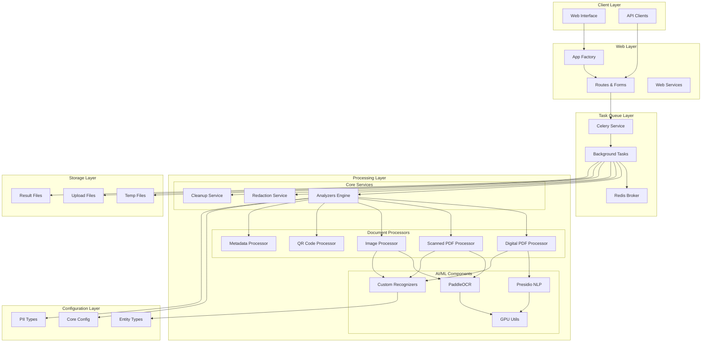
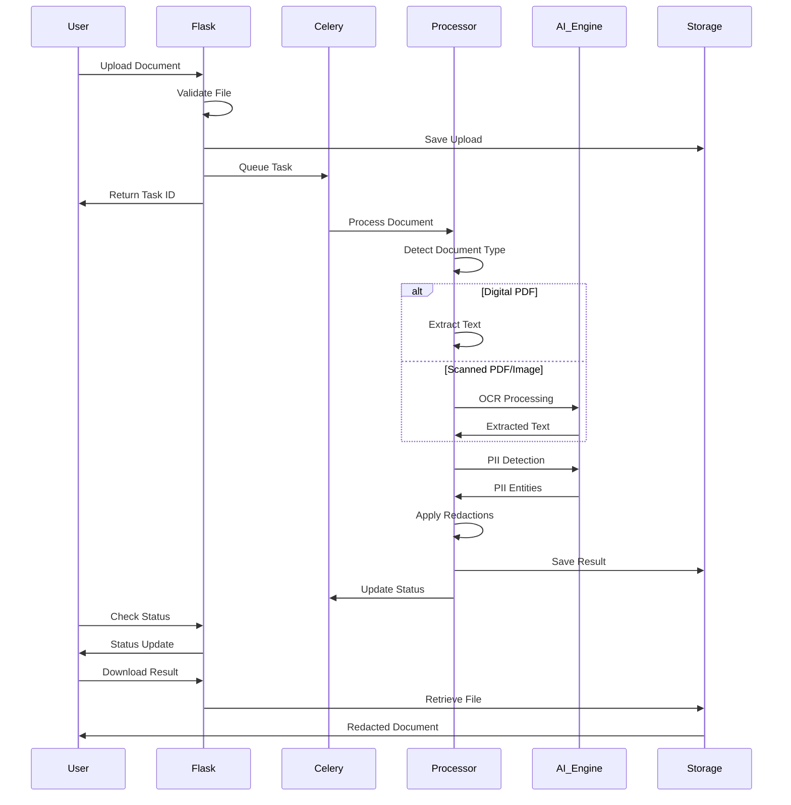
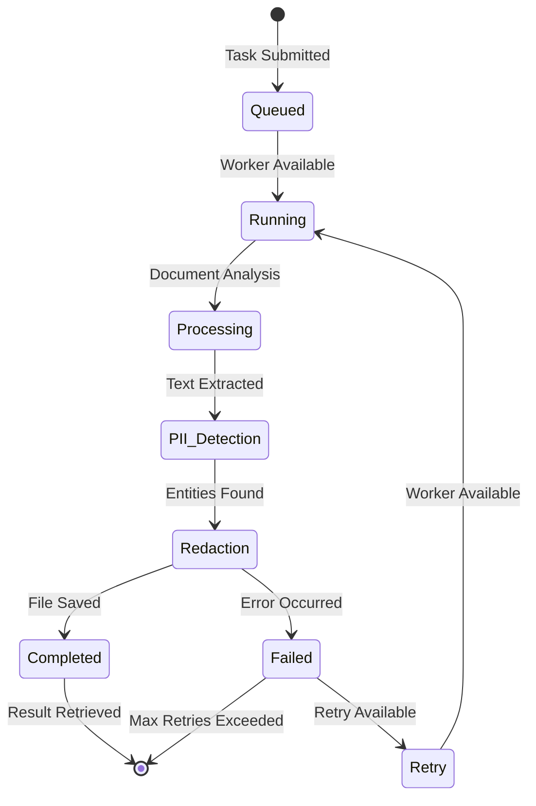

# 🏗️ Redactify Architecture Documentation

<div align="center">


*Comprehensive system design and component documentation*

</div>

---

## 📋 Table of Contents

- [🌟 System Overview](#-system-overview)
- [🏗️ High-Level Architecture](#️-high-level-architecture)
- [📦 Module Structure](#-module-structure)
- [🔄 Data Flow](#-data-flow)
- [🎯 Component Details](#-component-details)
- [🔧 Design Patterns](#-design-patterns)
- [🚀 Scalability](#-scalability)
- [🔒 Security Architecture](#-security-architecture)

---

## 🌟 System Overview

Redactify is built as a **modular, microservice-oriented** application using Flask for the web layer and Celery for asynchronous task processing. The architecture follows **separation of concerns** principles with clear boundaries between different functional areas.

### 🎯 Core Design Principles

1. **Modularity** - Each component has a single responsibility
2. **Scalability** - Horizontal scaling through worker processes
3. **Reliability** - Error handling and graceful degradation
4. **Security** - Secure file handling and data protection
5. **Performance** - GPU acceleration and optimized processing
6. **Maintainability** - Clean code and comprehensive testing

---

## 🏗️ High-Level Architecture

## 🏗️ High-Level Architecture



### 🎯 Architecture Layers

| Layer | Purpose | Components |
|-------|---------|------------|
| **Client** | User interaction | Web UI, REST API clients |
| **Web** | Request handling | Flask app factory, routes, forms |
| **Task Queue** | Async processing | Celery workers, Redis message broker |
| **Processing** | Core business logic | Document processors, AI engines, services |
| **Configuration** | System configuration | Config management, PII type definitions |
| **Storage** | File management | Temporary files, uploads, results |

        Flask[Flask Application]
        Routes[Route Handlers]
        Forms[Form Processing]
    end
    
    subgraph "Task Queue Layer"
        Redis[(Redis)]
        Celery[Celery Workers]
        Beat[Celery Beat Scheduler]
    end
    
    subgraph "Processing Layer"
        ProcessorManager[Processor Manager]
        PDFProcessor[PDF Processor]
        ImageProcessor[Image Processor]
        OCREngine[OCR Engine]
    end
    
    subgraph "AI/ML Layer"
        Presidio[Presidio NLP]
        PaddleOCR[PaddleOCR]
        CustomRecognizers[Custom Recognizers]
        SpaCy[spaCy Models]
    end
    
    subgraph "Storage Layer"
        TempFiles[(Temporary Files)]
        UploadFiles[(Upload Files)]
        ProcessedFiles[(Processed Files)]
    end
    
    UI --> Flask
    API --> Flask
    Flask --> Routes
    Routes --> Forms
    Routes --> Celery
    Celery --> Redis
    Beat --> Redis
    Celery --> ProcessorManager
    ProcessorManager --> PDFProcessor
    ProcessorManager --> ImageProcessor
    PDFProcessor --> OCREngine
    ImageProcessor --> OCREngine
    OCREngine --> PaddleOCR
    ProcessorManager --> Presidio
    Presidio --> SpaCy
    Presidio --> CustomRecognizers
    ProcessorManager --> TempFiles
    ProcessorManager --> UploadFiles
    ProcessorManager --> ProcessedFiles

```

---

## 📦 Module Structure

### 🗂️ Directory Layout

```

Redactify/
├── 🏠 **init**.py              # Package initialization
├── 🚀 main.py                  # Application entry point
├── 📱 app.py                   # Legacy Flask app (deprecated)
│
├── 🧠 core/                    # Core system components
│   ├── analyzers.py            # PII analysis engine setup
│   ├── config.py               # Configuration management
│   └── pii_types.py            # PII type definitions
│
├── ⚙️ processors/              # Document processing modules
│   ├── digital_pdf_processor.py    # Digital PDF handling
│   ├── scanned_pdf_processor.py    # Scanned PDF + OCR
│   ├── image_processor.py          # Image processing
│   ├── pdf_detector.py             # PDF type detection
│   ├── qr_code_processor.py        # QR/Barcode detection
│   ├── signature_processor.py     # Signature detection
│   ├── text_label_processor.py    # Text labeling
│   └── metadata_processor.py      # Metadata cleaning
│
├── 🔍 recognizers/             # Custom PII recognition
│   ├── custom_recognizers.py      # Custom PII patterns
│   └── entity_types.py            # Entity type definitions
│
├── 🔧 services/                # Background services
│   ├── celery_service.py           # Celery configuration
│   ├── tasks.py                    # Async task definitions
│   ├── redaction.py               # Redaction orchestration
│   └── cleanup.py                 # File cleanup service
│
├── 🌐 web/                     # Web interface components
│   ├── app_factory.py             # Flask app factory
│   ├── routes.py                   # Web route handlers
│   └── forms.py                    # Form definitions
│
├── 🛠️ utils/                   # Utility functions
│   └── gpu_utils.py               # GPU management utilities
│
├── 🎨 static/                  # Static web assets
│   ├── style.css                  # Custom CSS
│   ├── script.js                  # JavaScript
│   └── bootstrap.min.css          # Bootstrap CSS
│
└── 📄 templates/               # HTML templates
    ├── base.html                   # Base template
    ├── index.html                  # Main upload page
    ├── progress.html               # Progress tracking
    ├── result.html                 # Results display
    ├── 404.html                    # Error pages
    └── 500.html

```

---

## 🔄 Data Flow

### 📥 Document Processing Pipeline



### 🔄 Task Lifecycle



---

## 🎯 Component Details

### 🧠 Core Components

#### `core/config.py` - Configuration Management

- **Purpose**: Centralized configuration loading and validation
- **Key Features**:
  - YAML configuration file support
  - Environment variable overrides
  - Default value fallbacks
  - Type validation and error handling

```python
# Configuration loading hierarchy:
# 1. Default values in DEFAULT_CONFIG
# 2. config.yaml file (if exists)
# 3. Environment variables (REDACTIFY_*)
# 4. Runtime overrides
```

#### `core/analyzers.py` - AI Engine Setup

- **Purpose**: Initialize and configure PII detection engines
- **Components**:
  - Presidio Analyzer setup
  - PaddleOCR initialization
  - Custom recognizer registration
  - GPU memory management

#### `core/pii_types.py` - PII Type System

- **Purpose**: Define supported PII types and categories
- **Features**:
  - Categorized PII types (Common, Advanced, Financial)
  - Friendly names for UI display
  - Extensible type system

### ⚙️ Processors

#### `processors/pdf_detector.py` - Document Classification

- **Purpose**: Determine if PDF is digital or scanned
- **Logic**:
  - Attempts text extraction
  - Analyzes text-to-image ratio
  - Falls back to OCR if needed

#### `processors/digital_pdf_processor.py` - Digital PDF Handling

- **Purpose**: Process PDFs with extractable text
- **Features**:
  - Direct text extraction
  - Coordinate-based redaction
  - Metadata cleaning
  - Font and formatting preservation

#### `processors/scanned_pdf_processor.py` - OCR PDF Processing

- **Purpose**: Handle scanned PDFs requiring OCR
- **Process**:
  - Convert pages to images
  - OCR text extraction
  - Coordinate mapping
  - Image-based redaction

#### `processors/image_processor.py` - Image Processing

- **Purpose**: Process standalone images
- **Capabilities**:
  - Multiple format support
  - OCR text extraction
  - Bounding box redaction
  - Quality preservation

### 🔍 Recognition System

#### `recognizers/custom_recognizers.py` - Custom PII Patterns

- **Purpose**: Extend Presidio with custom recognizers
- **Examples**:
  - Indian Aadhaar numbers
  - PAN card numbers
  - Passport patterns
  - Custom regex patterns

#### `recognizers/entity_types.py` - Entity Definitions

- **Purpose**: Define entity types and metadata
- **Structure**:
  - Entity type constants
  - Recognition patterns
  - Confidence thresholds

### 🔧 Services Layer

#### `services/celery_service.py` - Task Queue Configuration

- **Purpose**: Configure Celery for async processing
- **Features**:
  - Redis broker setup
  - Task routing configuration
  - Worker pool management
  - Monitoring integration

#### `services/tasks.py` - Task Definitions

- **Purpose**: Define background processing tasks
- **Tasks**:
  - `perform_redaction` - Main processing task
  - `cleanup_expired_files` - Maintenance task
  - Progress tracking and error handling

### 🌐 Web Layer

#### `web/app_factory.py` - Application Factory

- **Purpose**: Create and configure Flask application
- **Features**:
  - Environment-specific configuration
  - Extension initialization
  - Error handler registration
  - Security settings

#### `web/routes.py` - Route Handlers

- **Purpose**: Handle HTTP requests and responses
- **Endpoints**:
  - File upload and validation
  - Task status monitoring
  - Result download
  - API endpoints

---

## 🔧 Design Patterns

### 🏭 Factory Pattern

- **Used in**: Flask app creation, processor instantiation
- **Benefits**: Flexible configuration, easier testing

### 🎭 Strategy Pattern

- **Used in**: Document processor selection
- **Benefits**: Runtime processor switching based on document type

### 🔍 Observer Pattern

- **Used in**: Task progress monitoring
- **Benefits**: Real-time status updates

### 🏗️ Builder Pattern

- **Used in**: Configuration building
- **Benefits**: Step-by-step configuration construction

### 🔌 Plugin Pattern

- **Used in**: Custom recognizer system
- **Benefits**: Extensible PII detection

---

## 🚀 Scalability

### 📈 Horizontal Scaling

#### Worker Scaling

```python
# Scale workers based on load
celery worker --concurrency=8  # More workers per process
docker-compose up --scale worker=4  # More worker containers
```

#### Queue Partitioning

```python
# Separate queues for different workloads
TASK_ROUTES = {
    'heavy_processing': {'queue': 'gpu_queue'},
    'light_processing': {'queue': 'cpu_queue'},
    'maintenance': {'queue': 'maintenance_queue'}
}
```

### ⚡ Performance Optimization

#### GPU Utilization

- **Memory Management**: Configurable GPU memory allocation
- **Batch Processing**: Process multiple documents in batches
- **Model Caching**: Reuse loaded models across tasks

#### Caching Strategy

- **Redis Caching**: Cache frequently accessed data
- **Model Caching**: Keep AI models in memory
- **Result Caching**: Cache processing results

### 📊 Load Balancing

#### Service Distribution

```yaml
# Docker Compose scaling
services:
  web:
    replicas: 2
  worker-redaction:
    replicas: 4
  worker-maintenance:
    replicas: 1
```

---

## 🔒 Security Architecture

### 🛡️ Security Layers

#### Input Validation

- File type validation
- Size limit enforcement
- Content scanning
- Sanitization

#### Processing Security

- Isolated file processing
- Temporary file cleanup
- Memory limit enforcement
- Resource monitoring

#### Output Security

- Secure file serving
- Access control
- Audit logging
- Data encryption (configurable)

### 🔐 Data Protection

#### File Lifecycle Management

```python
# Secure file handling
1. Upload → Validation → Temporary Storage
2. Processing → Isolated Environment
3. Output → Secure Serving
4. Cleanup → Automatic Deletion
```

#### Access Control

- Request rate limiting
- IP-based restrictions (configurable)
- Authentication hooks (extensible)
- Authorization middleware

---

<div align="center">

## 🎯 Architecture Summary

| Layer | Purpose | Key Components | Scalability |
|-------|---------|----------------|-------------|
| **Web** | User Interface | Flask, Routes, Templates | Load Balancer |
| **Queue** | Task Management | Celery, Redis, Beat | Worker Scaling |
| **Processing** | Document Handling | Processors, OCR, AI | GPU Acceleration |
| **Storage** | Data Persistence | Files, Cache, Results | Distributed Storage |

---

**Need More Details?** 📖 [Component Documentation](components/) | 🔧 [Configuration Guide](configuration.md) | 🚀 [Deployment Guide](deployment.md)

</div>
