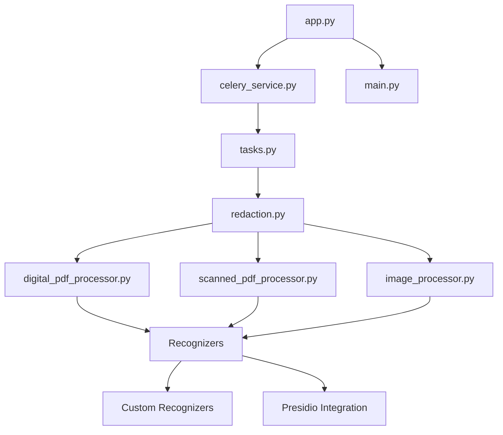

# 📚 Redactify Component Documentation

<div align="center">


*Detailed explanation of every component in the Redactify system*

</div>

---

## 📋 Component Overview

This directory contains detailed documentation for each component of the Redactify application, explaining the logic, design decisions, and implementation details.

### 🗂️ Documentation Structure

```
docs/components/
├── README.md                 # This file - Component overview
├── web-layer/               # Web interface components
│   ├── app.md              # Flask application setup
│   ├── main.md             # Main entry point
│   └── routes.md           # API endpoints
├── processors/             # Document processing engines
│   ├── digital-pdf.md      # Digital PDF processor
│   ├── scanned-pdf.md      # Scanned PDF processor
│   └── image.md            # Image processor
├── recognizers/            # PII detection modules
│   ├── overview.md         # Recognizer system overview
│   ├── custom.md           # Custom recognizers
│   └── presidio.md         # Presidio integration
├── services/               # Core business logic
│   ├── celery-service.md   # Task queue management
│   ├── tasks.md            # Background task definitions
│   └── redaction.md        # Core redaction logic
└── utilities/              # Helper modules
    ├── config.md           # Configuration management
    ├── logging.md          # Logging system
    └── helpers.md          # Utility functions
```

### 🎯 Reading Guide

1. **Start with**: `web-layer/app.md` to understand the application entry point
2. **Core Logic**: Review `services/` for business logic
3. **Processing**: Explore `processors/` for document handling
4. **Detection**: Study `recognizers/` for PII detection
5. **Infrastructure**: Check `utilities/` for supporting systems

### 📊 Component Dependencies



### 🔍 Quick Reference

| Component | Purpose | Key Technologies |
|-----------|---------|------------------|
| **Web Layer** | User interface and API | Flask, Jinja2, HTML/CSS/JS |
| **Processors** | Document parsing and processing | PyMuPDF, PaddleOCR, PIL |
| **Recognizers** | PII detection and classification | Presidio, SpaCy, Custom NLP |
| **Services** | Business logic and orchestration | Celery, Redis, Custom Logic |
| **Utilities** | Configuration and helpers | Python stdlib, Custom utilities |

---

*Each component documentation includes implementation details, design rationale, performance considerations, and usage examples.*
