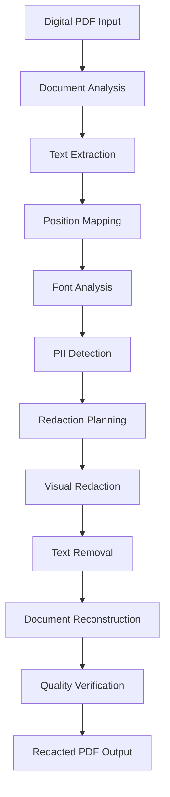

# 📄 Digital PDF Processor (digital_pdf_processor.py)

<div align="center">


*High-performance processing of digital PDF documents with extractable text*

</div>

---

## 📋 Overview

The `digital_pdf_processor.py` module handles the processing of digital PDF documents that contain selectable, extractable text. This processor focuses on preserving text formatting, extracting precise character positions, and applying accurate redactions while maintaining document structure and readability.

## 🏗️ Processing Architecture



## 🔧 Core Components

### 1. PDF Document Analyzer

```python
class DigitalPDFProcessor:
    """
    Processes digital PDF documents with extractable text content.
    Handles text extraction, position mapping, and precise redaction application.
    """
    
    def __init__(self, options=None):
        self.options = options or {}
        self.preserve_formatting = self.options.get('preserve_formatting', True)
        self.redaction_color = self.options.get('redaction_color', (0, 0, 0))  # Black
        self.redaction_method = self.options.get('redaction_method', 'overlay')
        
        # Performance settings
        self.use_text_blocks = self.options.get('use_text_blocks', True)
        self.extract_images = self.options.get('extract_images', False)
        self.maintain_fonts = self.options.get('maintain_fonts', True)
    
    def analyze_document(self, pdf_path):
        """
        Perform comprehensive analysis of PDF document structure.
        
        Args:
            pdf_path (str): Path to PDF file
            
        Returns:
            dict: Document analysis results
        """
        
        import fitz  # PyMuPDF
        
        doc = fitz.open(pdf_path)
        analysis = {
            'total_pages': len(doc),
            'has_text': False,
            'text_coverage': 0.0,
            'fonts_used': set(),
            'page_sizes': [],
            'security_info': {},
            'metadata': doc.metadata,
            'is_searchable': True
        }
        
        total_text_chars = 0
        total_possible_chars = 0
        
        for page_num in range(len(doc)):
            page = doc[page_num]
            
            # Analyze page size
            analysis['page_sizes'].append({
                'page': page_num + 1,
                'width': page.rect.width,
                'height': page.rect.height,
                'rotation': page.rotation
            })
            
            # Extract text and analyze content
            text_dict = page.get_text("dict")
            page_text_chars = 0
            
            for block in text_dict["blocks"]:
                if "lines" in block:  # Text block
                    for line in block["lines"]:
                        for span in line["spans"]:
                            font_info = f"{span['font']}_{span['size']}"
                            analysis['fonts_used'].add(font_info)
                            page_text_chars += len(span['text'])
            
            total_text_chars += page_text_chars
            # Estimate total possible characters based on page area
            total_possible_chars += (page.rect.width * page.rect.height) / 100
        
        doc.close()
        
        # Calculate text coverage
        analysis['has_text'] = total_text_chars > 0
        analysis['text_coverage'] = min(total_text_chars / max(total_possible_chars, 1), 1.0)
        analysis['fonts_used'] = list(analysis['fonts_used'])
        
        # Check if document is truly searchable
        analysis['is_searchable'] = analysis['text_coverage'] > 0.1
        
        return analysis
```

**Logic Explanation:**

- **Text Coverage Analysis**: Determines if PDF contains sufficient extractable text
- **Font Detection**: Identifies fonts for formatting preservation
- **Searchability Assessment**: Validates that text extraction will be effective
- **Metadata Extraction**: Gathers document properties for processing optimization

### 2. Advanced Text Extraction

```python
def extract_text_with_positions(self, pdf_path):
    """
    Extract text content with precise positional information.
    
    Args:
        pdf_path (str): Path to PDF file
        
    Returns:
        dict: Text content with position mappings
    """
    
    import fitz
    
    doc = fitz.open(pdf_path)
    extraction_result = {
        'pages': [],
        'total_text': '',
        'character_map': [],  # Maps each character to its position
        'word_boundaries': [],
        'line_boundaries': [],
        'extraction_stats': {}
    }
    
    global_char_index = 0
    
    for page_num in range(len(doc)):
        page = doc[page_num]
        page_data = {
            'page_number': page_num + 1,
            'text_blocks': [],
            'images': [],
            'page_size': (page.rect.width, page.rect.height)
        }
        
        # Extract text with detailed position information
        text_dict = page.get_text("dict")
        
        for block_num, block in enumerate(text_dict["blocks"]):
            if "lines" in block:  # Text block
                block_data = {
                    'block_id': block_num,
                    'bbox': block["bbox"],
                    'lines': []
                }
                
                for line_num, line in enumerate(block["lines"]):
                    line_data = {
                        'line_id': line_num,
                        'bbox': line["bbox"],
                        'spans': []
                    }
                    
                    for span_num, span in enumerate(line["spans"]):
                        span_text = span["text"]
                        span_data = {
                            'span_id': span_num,
                            'text': span_text,
                            'bbox': span["bbox"],
                            'font': span["font"],
                            'font_size': span["size"],
                            'font_flags': span["flags"],
                            'color': span.get("color", 0),
                            'char_positions': []
                        }
                        
                        # Calculate individual character positions
                        char_width = (span["bbox"][2] - span["bbox"][0]) / max(len(span_text), 1)
                        
                        for char_idx, char in enumerate(span_text):
                            char_x = span["bbox"][0] + (char_idx * char_width)
                            char_position = {
                                'char': char,
                                'global_index': global_char_index,
                                'page': page_num + 1,
                                'bbox': [
                                    char_x,
                                    span["bbox"][1],
                                    char_x + char_width,
                                    span["bbox"][3]
                                ],
                                'font_info': {
                                    'font': span["font"],
                                    'size': span["size"],
                                    'color': span.get("color", 0)
                                }
                            }
                            
                            span_data['char_positions'].append(char_position)
                            extraction_result['character_map'].append(char_position)
                            global_char_index += 1
                        
                        line_data['spans'].append(span_data)
                        extraction_result['total_text'] += span_text
                    
                    block_data['lines'].append(line_data)
                
                page_data['text_blocks'].append(block_data)
            
            elif "image" in block:  # Image block
                if self.extract_images:
                    image_data = {
                        'bbox': block["bbox"],
                        'image_index': len(page_data['images']),
                        'needs_ocr': True
                    }
                    page_data['images'].append(image_data)
        
        extraction_result['pages'].append(page_data)
    
    doc.close()
    
    # Generate extraction statistics
    extraction_result['extraction_stats'] = self._calculate_extraction_stats(extraction_result)
    
    return extraction_result

def _calculate_extraction_stats(self, extraction_result):
    """Calculate statistics about the extraction process."""
    
    stats = {
        'total_characters': len(extraction_result['character_map']),
        'total_words': len(extraction_result['total_text'].split()),
        'pages_processed': len(extraction_result['pages']),
        'fonts_detected': set(),
        'average_font_size': 0,
        'text_density_per_page': []
    }
    
    font_sizes = []
    
    for page in extraction_result['pages']:
        page_chars = 0
        for block in page['text_blocks']:
            for line in block['lines']:
                for span in line['spans']:
                    stats['fonts_detected'].add(span['font'])
                    font_sizes.append(span['font_size'])
                    page_chars += len(span['text'])
        
        page_area = page['page_size'][0] * page['page_size'][1]
        stats['text_density_per_page'].append(page_chars / page_area if page_area > 0 else 0)
    
    stats['fonts_detected'] = list(stats['fonts_detected'])
    stats['average_font_size'] = sum(font_sizes) / len(font_sizes) if font_sizes else 0
    
    return stats
```

### 3. Intelligent Redaction Engine

```python
def apply_redactions(self, pdf_path, pii_results):
    """
    Apply redactions to PDF while preserving document structure.
    
    Args:
        pdf_path (str): Path to original PDF
        pii_results (dict): PII detection results with positions
        
    Returns:
        str: Path to redacted PDF file
    """
    
    import fitz
    
    # Create output path
    output_path = pdf_path.replace('.pdf', '_redacted.pdf')
    
    # Open source document
    doc = fitz.open(pdf_path)
    
    redaction_stats = {
        'total_redactions': 0,
        'redactions_by_type': {},
        'redactions_by_page': {},
        'failed_redactions': []
    }
    
    for entity in pii_results.get('entities', []):
        try:
            page_num = entity.get('page', 1) - 1  # Convert to 0-based
            if page_num >= len(doc):
                continue
                
            page = doc[page_num]
            entity_type = entity.get('label', 'UNKNOWN')
            
            # Get entity position information
            start_pos = entity.get('start', 0)
            end_pos = entity.get('end', 0)
            text_content = entity.get('text', '')
            
            # Find exact text positions in PDF
            text_instances = page.search_for(text_content)
            
            if text_instances:
                for instance_rect in text_instances:
                    # Apply redaction based on method
                    if self.redaction_method == 'overlay':
                        self._apply_overlay_redaction(page, instance_rect, entity_type)
                    elif self.redaction_method == 'removal':
                        self._apply_removal_redaction(page, instance_rect)
                    elif self.redaction_method == 'replacement':
                        self._apply_replacement_redaction(page, instance_rect, entity_type)
                    
                    # Update statistics
                    redaction_stats['total_redactions'] += 1
                    if entity_type not in redaction_stats['redactions_by_type']:
                        redaction_stats['redactions_by_type'][entity_type] = 0
                    redaction_stats['redactions_by_type'][entity_type] += 1
                    
                    if page_num not in redaction_stats['redactions_by_page']:
                        redaction_stats['redactions_by_page'][page_num] = 0
                    redaction_stats['redactions_by_page'][page_num] += 1
            
            else:
                # Fallback: Use character position mapping
                char_positions = self._find_character_positions(pdf_path, start_pos, end_pos)
                if char_positions:
                    for char_rect in char_positions:
                        self._apply_overlay_redaction(page, char_rect, entity_type)
                        redaction_stats['total_redactions'] += 1
                else:
                    redaction_stats['failed_redactions'].append({
                        'entity': entity,
                        'reason': 'Could not locate text in PDF'
                    })
        
        except Exception as exc:
            redaction_stats['failed_redactions'].append({
                'entity': entity,
                'reason': str(exc)
            })
    
    # Save redacted document
    doc.save(output_path, garbage=4, deflate=True)
    doc.close()
    
    # Save redaction statistics
    stats_path = output_path.replace('.pdf', '_redaction_stats.json')
    with open(stats_path, 'w') as f:
        json.dump(redaction_stats, f, indent=2)
    
    return output_path

def _apply_overlay_redaction(self, page, rect, entity_type):
    """Apply black overlay redaction."""
    
    # Create redaction annotation
    redact_annot = page.add_redact_annot(rect)
    redact_annot.set_colors(stroke=self.redaction_color, fill=self.redaction_color)
    redact_annot.update()
    
    # Apply redaction
    page.apply_redactions()

def _apply_removal_redaction(self, page, rect):
    """Remove text completely (leaves white space)."""
    
    # Add white rectangle to cover text
    white_rect = page.new_shape()
    white_rect.draw_rect(rect)
    white_rect.fill = (1, 1, 1)  # White
    white_rect.color = (1, 1, 1)  # White border
    white_rect.commit()

def _apply_replacement_redaction(self, page, rect, entity_type):
    """Replace text with entity type placeholder."""
    
    # Remove original text
    self._apply_removal_redaction(page, rect)
    
    # Add replacement text
    replacement_text = f"[{entity_type}]"
    
    # Calculate font size based on rectangle height
    font_size = min(rect.height * 0.8, 12)
    
    # Insert replacement text
    text_point = fitz.Point(rect.x0, rect.y1 - 2)
    page.insert_text(
        text_point,
        replacement_text,
        fontsize=font_size,
        color=(0, 0, 0),  # Black text
        fontname="helv"   # Helvetica
    )
```

### 4. Quality Assurance and Validation

```python
def validate_redaction_quality(self, original_path, redacted_path, pii_results):
    """
    Validate that redactions were applied correctly and completely.
    
    Args:
        original_path (str): Path to original PDF
        redacted_path (str): Path to redacted PDF  
        pii_results (dict): Original PII detection results
        
    Returns:
        dict: Validation results and quality metrics
    """
    
    import fitz
    
    validation_result = {
        'validation_passed': True,
        'issues_found': [],
        'redaction_coverage': 0.0,
        'text_removal_rate': 0.0,
        'quality_score': 0.0,
        'recommendations': []
    }
    
    # Open both documents
    original_doc = fitz.open(original_path)
    redacted_doc = fitz.open(redacted_path)
    
    try:
        # Extract text from both versions
        original_text = ""
        redacted_text = ""
        
        for page_num in range(len(original_doc)):
            original_text += original_doc[page_num].get_text()
            if page_num < len(redacted_doc):
                redacted_text += redacted_doc[page_num].get_text()
        
        # Check for remaining PII in redacted version
        remaining_pii = []
        for entity in pii_results.get('entities', []):
            entity_text = entity.get('text', '')
            if entity_text.lower() in redacted_text.lower():
                remaining_pii.append(entity)
                validation_result['issues_found'].append({
                    'type': 'PII_STILL_PRESENT',
                    'entity': entity,
                    'message': f"PII text '{entity_text}' still visible in redacted document"
                })
        
        # Calculate metrics
        total_pii_entities = len(pii_results.get('entities', []))
        successfully_redacted = total_pii_entities - len(remaining_pii)
        
        validation_result['redaction_coverage'] = (
            successfully_redacted / total_pii_entities if total_pii_entities > 0 else 1.0
        )
        
        # Calculate text removal rate
        original_length = len(original_text)
        redacted_length = len(redacted_text)
        validation_result['text_removal_rate'] = (
            (original_length - redacted_length) / original_length if original_length > 0 else 0.0
        )
        
        # Check document structure preservation
        if len(original_doc) != len(redacted_doc):
            validation_result['issues_found'].append({
                'type': 'PAGE_COUNT_MISMATCH',
                'message': f"Page count changed: {len(original_doc)} -> {len(redacted_doc)}"
            })
        
        # Calculate overall quality score
        quality_factors = [
            validation_result['redaction_coverage'] * 0.5,  # 50% weight
            (1 - len(remaining_pii) / max(total_pii_entities, 1)) * 0.3,  # 30% weight
            (1 if len(validation_result['issues_found']) == 0 else 0.5) * 0.2  # 20% weight
        ]
        validation_result['quality_score'] = sum(quality_factors)
        
        # Generate recommendations
        if validation_result['redaction_coverage'] < 0.95:
            validation_result['recommendations'].append(
                "Some PII entities may not have been properly redacted. Manual review recommended."
            )
        
        if validation_result['text_removal_rate'] > 0.5:
            validation_result['recommendations'].append(
                "High text removal rate detected. Verify that non-PII content was not over-redacted."
            )
        
        validation_result['validation_passed'] = (
            len(remaining_pii) == 0 and 
            validation_result['quality_score'] > 0.8
        )
        
    finally:
        original_doc.close()
        redacted_doc.close()
    
    return validation_result
```

## ⚡ Performance Optimizations

### 1. Memory-Efficient Processing

```python
def process_large_pdf(self, pdf_path, chunk_size=10):
    """
    Process large PDFs in chunks to manage memory usage.
    
    Args:
        pdf_path (str): Path to large PDF file
        chunk_size (int): Number of pages to process at once
        
    Returns:
        dict: Processing results
    """
    
    import fitz
    
    doc = fitz.open(pdf_path)
    total_pages = len(doc)
    
    if total_pages <= chunk_size:
        # Process normally for small documents
        return self.extract_text_with_positions(pdf_path)
    
    # Process in chunks
    all_results = {
        'pages': [],
        'total_text': '',
        'character_map': [],
        'extraction_stats': {}
    }
    
    for start_page in range(0, total_pages, chunk_size):
        end_page = min(start_page + chunk_size, total_pages)
        
        # Create temporary PDF with chunk pages
        temp_doc = fitz.open()
        temp_doc.insert_pdf(doc, from_page=start_page, to_page=end_page-1)
        
        temp_path = f"{pdf_path}.temp_chunk_{start_page}_{end_page}.pdf"
        temp_doc.save(temp_path)
        temp_doc.close()
        
        # Process chunk
        chunk_results = self.extract_text_with_positions(temp_path)
        
        # Merge results
        all_results['pages'].extend(chunk_results['pages'])
        all_results['total_text'] += chunk_results['total_text']
        all_results['character_map'].extend(chunk_results['character_map'])
        
        # Clean up temporary file
        os.remove(temp_path)
        
        # Force garbage collection
        import gc
        gc.collect()
    
    doc.close()
    
    # Calculate combined statistics
    all_results['extraction_stats'] = self._calculate_extraction_stats(all_results)
    
    return all_results
```

### 2. Font and Formatting Preservation

```python
def preserve_document_formatting(self, pdf_path, redacted_path):
    """
    Ensure redacted document maintains original formatting as much as possible.
    
    Args:
        pdf_path (str): Original PDF path
        redacted_path (str): Redacted PDF path
        
    Returns:
        dict: Formatting preservation report
    """
    
    import fitz
    
    preservation_report = {
        'fonts_preserved': [],
        'fonts_modified': [],
        'layout_changes': [],
        'formatting_score': 0.0
    }
    
    original_doc = fitz.open(pdf_path)
    redacted_doc = fitz.open(redacted_path)
    
    try:
        # Compare fonts between documents
        original_fonts = set()
        redacted_fonts = set()
        
        for page_num in range(len(original_doc)):
            # Analyze original fonts
            orig_page = original_doc[page_num]
            orig_text_dict = orig_page.get_text("dict")
            
            for block in orig_text_dict["blocks"]:
                if "lines" in block:
                    for line in block["lines"]:
                        for span in line["spans"]:
                            font_key = f"{span['font']}_{span['size']}"
                            original_fonts.add(font_key)
            
            # Analyze redacted fonts (if page exists)
            if page_num < len(redacted_doc):
                red_page = redacted_doc[page_num]
                red_text_dict = red_page.get_text("dict")
                
                for block in red_text_dict["blocks"]:
                    if "lines" in block:
                        for line in block["lines"]:
                            for span in line["spans"]:
                                font_key = f"{span['font']}_{span['size']}"
                                redacted_fonts.add(font_key)
        
        # Calculate preservation metrics
        preservation_report['fonts_preserved'] = list(original_fonts & redacted_fonts)
        preservation_report['fonts_modified'] = list(original_fonts - redacted_fonts)
        
        font_preservation_rate = (
            len(preservation_report['fonts_preserved']) / 
            len(original_fonts) if original_fonts else 1.0
        )
        
        preservation_report['formatting_score'] = font_preservation_rate
        
    finally:
        original_doc.close()
        redacted_doc.close()
    
    return preservation_report
```

---

**Next**: Review [`scanned-pdf.md`](scanned-pdf.md) for scanned PDF processing with OCR.
