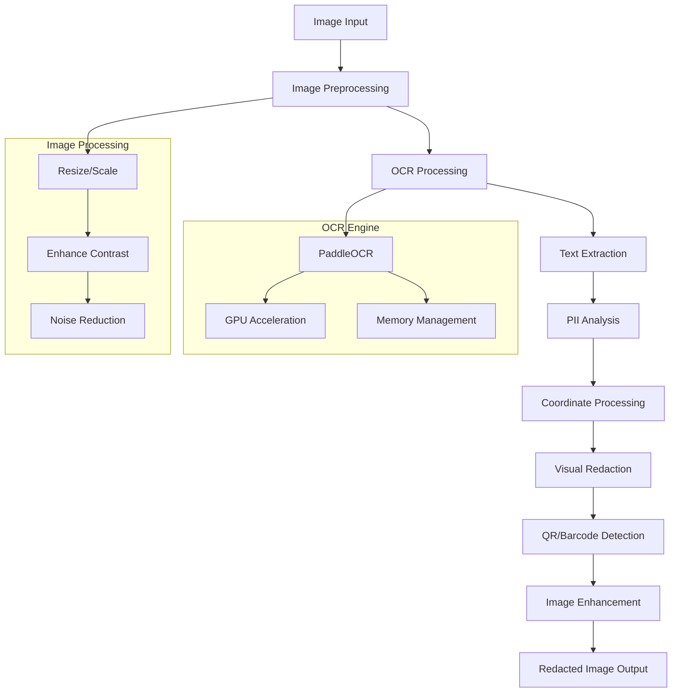

# 🖼️ Image Processor

The `image_processor.py` module handles OCR-based processing of image files including JPEG, PNG, TIFF, and BMP formats for PII detection and redaction.

## Overview

This processor is designed for standalone image files that require text extraction and PII redaction. It leverages advanced OCR technology combined with computer vision techniques to detect and redact sensitive information while preserving image quality.

## Architecture



## Key Features

### 🔍 **Advanced Image Processing**

- **Multi-format Support** - JPEG, PNG, TIFF, BMP, and other common formats
- **Automatic Enhancement** - Improves image quality for better OCR accuracy
- **Resolution Optimization** - Scales images for optimal OCR performance
- **Color Space Handling** - Supports RGB, RGBA, grayscale processing

### 📊 **Intelligent Text Detection**

- **PaddleOCR Integration** - State-of-the-art multilingual OCR engine
- **Confidence Filtering** - Configurable OCR confidence thresholds
- **Multi-language Support** - Optimized for English with extensible language support
- **Text Block Recognition** - Accurate bounding box detection

### 🎯 **Precise Visual Redaction**

- **Pixel-perfect Redaction** - Black boxes overlaid on sensitive content
- **Quality Preservation** - Maintains original image quality and format
- **Coordinate Accuracy** - Precise mapping of text locations
- **QR/Barcode Integration** - Comprehensive encoded data detection

## Usage

### Basic Usage

```python
from Redactify.processors.image_processor import process_image

# Process an image file
result = process_image(
    input_path="document.jpg",
    output_path="redacted_document.jpg", 
    pii_types=['PERSON', 'EMAIL_ADDRESS', 'PHONE_NUMBER'],
    presidio_analyzer=analyzer,
    progress_callback=lambda p: print(f"Progress: {p}%")
)

print(f"Redacted {result['total_entities_redacted']} PII entities")
print(f"Processing time: {result['processing_time_seconds']} seconds")
```

### Advanced Configuration

```python
# Custom processing settings
processing_config = {
    'enhance_image': True,        # Enable automatic image enhancement
    'target_dpi': 300,           # Target DPI for OCR processing
    'max_dimension': 4000,       # Maximum image dimension (pixels)
    'preserve_alpha': True,      # Preserve transparency in PNG files
    'jpeg_quality': 95           # JPEG compression quality for output
}

result = process_image(
    input_path="scanned_form.png",
    output_path="redacted_form.png",
    pii_types=['INDIA_AADHAAR_NUMBER', 'INDIA_PAN_NUMBER'],
    presidio_analyzer=analyzer,
    confidence_threshold=0.8,    # Higher threshold for accuracy
    detect_qr_barcodes=True,     # Enable QR/barcode detection
    processing_config=processing_config,
    debug_save_intermediate=True  # Save debug images
)
```

## Core Functions

### `process_image()`

Main function for processing image files with PII detection and redaction.

**Parameters:**

- `input_path` (str): Path to input image file
- `output_path` (str): Path for redacted output image
- `pii_types` (List[str]): PII types to detect and redact
- `presidio_analyzer`: Presidio analyzer instance
- `progress_callback` (callable, optional): Progress reporting function
- `confidence_threshold` (float): OCR confidence threshold (0.0-1.0)
- `detect_qr_barcodes` (bool): Enable QR/barcode detection
- `processing_config` (dict, optional): Image processing configuration
- `debug_save_intermediate` (bool): Save intermediate processing images

**Returns:**

- Dictionary with processing results and statistics

### `enhance_image_for_ocr()`

Enhances image quality to improve OCR accuracy.

**Parameters:**

- `image` (PIL.Image): Input image
- `target_dpi` (int): Target resolution for processing
- `enhance_contrast` (bool): Apply contrast enhancement

**Returns:**

- Enhanced PIL Image object

### `run_ocr_safely()`

Executes OCR processing with timeout protection and error handling.

**Parameters:**

- `ocr`: PaddleOCR instance
- `img_array`: Input image as numpy array

**Returns:**

- OCR results with text, confidence scores, and bounding boxes

### `redact_image_regions()`

Applies visual redaction to specified image regions.

**Parameters:**

- `image` (PIL.Image): Input image
- `redaction_boxes` (List[Tuple]): List of (x, y, width, height) coordinates
- `redaction_color` (Tuple): RGB color for redaction boxes

**Returns:**

- Redacted PIL Image object

## Configuration

### OCR Settings

```yaml
# In config.yaml
ocr_confidence_threshold: 0.1   # Lower = more text detected
image_processing:
  enhance_images: true          # Auto-enhance for better OCR
  target_dpi: 300              # Optimal DPI for OCR
  max_dimension: 4000          # Maximum image size (pixels)
  preserve_alpha: true         # Keep transparency in PNG files
  
paddle_ocr_config:
  use_angle_cls: true          # Text angle classification
  lang: 'en'                   # Language detection
  use_gpu: true                # GPU acceleration
  gpu_mem: 8000               # GPU memory limit (MB)
```

### Image Enhancement

```yaml
# Image enhancement settings
enhancement:
  auto_contrast: true          # Automatic contrast adjustment
  sharpen: false              # Text sharpening (can introduce artifacts)
  denoise: true               # Noise reduction
  brightness_adjust: 0        # Brightness adjustment (-100 to 100)
  contrast_adjust: 0          # Contrast adjustment (-100 to 100)
```

## Performance Optimization

### GPU Acceleration

Automatic GPU detection and utilization:

```python
# GPU resource management
with GPUResourceManager() as gpu_manager:
    if gpu_manager.is_gpu_available():
        ocr = PaddleOCR(
            use_gpu=True, 
            gpu_mem=8000,
            use_angle_cls=True,
            lang='en'
        )
    else:
        ocr = PaddleOCR(use_gpu=False)
        logging.info("GPU not available, using CPU processing")
```

### Memory Management

```python
def check_memory_usage():
    """Monitor memory usage and trigger cleanup if needed"""
    mem = psutil.virtual_memory()
    if mem.percent > 85:
        logging.warning(f"High memory usage: {mem.percent}%")
        aggressive_cleanup()
        return True
    return False

def aggressive_cleanup():
    """Perform comprehensive memory cleanup"""
    collected = gc.collect(2)  # Full garbage collection
    logging.info(f"Garbage collection: collected {collected} objects")
    time.sleep(0.1)  # Allow OS to reclaim memory
```

### Image Size Optimization

```python
def optimize_image_size(image, max_dimension=4000, target_dpi=300):
    """Optimize image size for OCR processing"""
    width, height = image.size
    
    # Calculate scaling factor
    max_current = max(width, height)
    if max_current > max_dimension:
        scale_factor = max_dimension / max_current
        new_width = int(width * scale_factor)
        new_height = int(height * scale_factor)
        
        image = image.resize((new_width, new_height), Image.LANCZOS)
        logging.info(f"Resized image from {width}x{height} to {new_width}x{new_height}")
    
    return image
```

## Error Handling

### Common Issues and Solutions

#### Memory Errors with Large Images

```python
def handle_large_image(image_path):
    """Handle processing of very large images"""
    try:
        with Image.open(image_path) as img:
            # Check image size
            width, height = img.size
            pixel_count = width * height
            
            if pixel_count > 50_000_000:  # 50 megapixels
                # Process in tiles or downsample
                return process_image_in_tiles(img)
            else:
                return process_image_normally(img)
                
    except MemoryError:
        logging.error("Insufficient memory for image processing")
        # Fall back to tile-based processing
        return process_image_in_tiles(image_path, tile_size=2000)
```

#### OCR Timeout Protection

```python
def process_with_timeout(ocr, image_array, timeout=120):
    """Process image with timeout protection"""
    try:
        with time_limit(timeout):
            result = ocr.ocr(image_array)
            return result
    except TimeoutError:
        logging.warning(f"OCR processing timed out after {timeout} seconds")
        return []  # Return empty result
```

#### Format-specific Handling

```python
def save_image_with_format_preservation(image, output_path, original_format):
    """Save image while preserving original format characteristics"""
    
    if original_format.upper() == 'PNG':
        # Preserve transparency
        image.save(output_path, format='PNG', optimize=True)
    elif original_format.upper() in ['JPEG', 'JPG']:
        # Remove alpha channel for JPEG
        if image.mode == 'RGBA':
            background = Image.new('RGB', image.size, (255, 255, 255))
            background.paste(image, mask=image.split()[-1])
            image = background
        image.save(output_path, format='JPEG', quality=95, optimize=True)
    else:
        # Use original format
        image.save(output_path, format=original_format, optimize=True)
```

## Supported Formats

### Input Formats

| Format | Extension | Color Modes | Notes |
|--------|-----------|-------------|-------|
| **JPEG** | .jpg, .jpeg | RGB, Grayscale | Most common format, good compression |
| **PNG** | .png | RGB, RGBA, Grayscale | Supports transparency, lossless |
| **TIFF** | .tiff, .tif | RGB, RGBA, Grayscale | High quality, multiple pages |
| **BMP** | .bmp | RGB, Grayscale | Uncompressed, large file sizes |
| **WEBP** | .webp | RGB, RGBA | Modern format, good compression |
| **GIF** | .gif | Palette, Grayscale | Limited color palette |

### Quality Recommendations

| Use Case | Recommended Format | Settings |
|----------|-------------------|----------|
| **Documents** | PNG | Lossless, preserve text clarity |
| **Photos** | JPEG | Quality 90-95, good compression |
| **Forms** | PNG/TIFF | High resolution, preserve details |
| **Scanned Pages** | PNG | Lossless, maintain OCR accuracy |

## Integration Examples

### Batch Processing

```python
import os
from pathlib import Path

def process_image_directory(input_dir, output_dir, pii_types):
    """Process all images in a directory"""
    
    input_path = Path(input_dir)
    output_path = Path(output_dir)
    output_path.mkdir(exist_ok=True)
    
    supported_formats = {'.jpg', '.jpeg', '.png', '.tiff', '.tif', '.bmp'}
    
    for image_file in input_path.iterdir():
        if image_file.suffix.lower() in supported_formats:
            output_file = output_path / f"redacted_{image_file.name}"
            
            try:
                result = process_image(
                    input_path=str(image_file),
                    output_path=str(output_file),
                    pii_types=pii_types,
                    presidio_analyzer=get_analyzer()
                )
                
                print(f"Processed {image_file.name}: {result['total_entities_redacted']} PII found")
                
            except Exception as e:
                logging.error(f"Failed to process {image_file.name}: {e}")
```

### Web Upload Integration

```python
# Flask route for image upload
@bp.route('/upload_image', methods=['POST'])
def upload_and_process_image():
    if 'file' not in request.files:
        return jsonify({'error': 'No file uploaded'}), 400
    
    file = request.files['file']
    pii_types = request.form.getlist('pii_types')
    
    # Validate file format
    if not allowed_image_file(file.filename):
        return jsonify({'error': 'Unsupported image format'}), 400
    
    # Save uploaded file
    filename = secure_filename(file.filename)
    input_path = os.path.join(UPLOAD_DIR, filename)
    file.save(input_path)
    
    # Queue processing task
    task = process_image_task.delay(
        input_path=input_path,
        pii_types=pii_types
    )
    
    return jsonify({'task_id': task.id})

def allowed_image_file(filename):
    """Check if file is a supported image format"""
    return '.' in filename and \
           filename.rsplit('.', 1)[1].lower() in \
           {'jpg', 'jpeg', 'png', 'tiff', 'tif', 'bmp', 'webp'}
```

## Debugging and Troubleshooting

### Debug Output

Enable debug image saving to analyze processing steps:

```python
result = process_image(
    input_path="form.jpg",
    output_path="redacted_form.jpg",
    pii_types=['PERSON'],
    presidio_analyzer=analyzer,
    debug_save_intermediate=True  # Saves to temp_files/debug/
)
```

Debug images include:

- **Enhanced image** - After preprocessing and enhancement
- **OCR detection overlay** - Bounding boxes around detected text
- **PII detection markup** - Highlighted PII entities
- **Final redacted image** - Result after redaction

### Performance Monitoring

```python
import time
import psutil

def monitor_image_processing(image_path):
    """Monitor processing performance"""
    
    # Get image info
    with Image.open(image_path) as img:
        width, height = img.size
        pixel_count = width * height
        file_size = os.path.getsize(image_path)
    
    start_time = time.time()
    start_memory = psutil.virtual_memory().percent
    
    # Process image
    result = process_image(
        input_path=image_path,
        output_path="output.jpg",
        pii_types=['PERSON', 'EMAIL_ADDRESS'],
        presidio_analyzer=get_analyzer()
    )
    
    end_time = time.time()
    end_memory = psutil.virtual_memory().percent
    processing_time = end_time - start_time
    
    # Calculate metrics
    pixels_per_second = pixel_count / processing_time
    mb_per_second = (file_size / 1024 / 1024) / processing_time
    
    print(f"Image: {width}x{height} ({pixel_count:,} pixels, {file_size/1024/1024:.1f}MB)")
    print(f"Processing time: {processing_time:.2f} seconds")
    print(f"Performance: {pixels_per_second:,.0f} pixels/sec, {mb_per_second:.1f} MB/sec")
    print(f"Memory usage change: {end_memory - start_memory:.1f}%")
    print(f"Entities found: {result['total_entities_redacted']}")
```

### Troubleshooting Common Issues

#### 1. **Poor OCR Accuracy**

```python
# Enhance image before processing
def improve_ocr_accuracy(image_path):
    with Image.open(image_path) as img:
        # Convert to grayscale if needed
        if img.mode != 'L':
            img = img.convert('L')
        
        # Increase contrast
        enhancer = ImageEnhance.Contrast(img)
        img = enhancer.enhance(1.5)
        
        # Increase size if small
        width, height = img.size
        if max(width, height) < 1000:
            scale_factor = 1000 / max(width, height)
            new_size = (int(width * scale_factor), int(height * scale_factor))
            img = img.resize(new_size, Image.LANCZOS)
        
        return img
```

#### 2. **Memory Issues with Large Images**

```python
# Process large images in tiles
def process_large_image(image_path, tile_size=2000):
    with Image.open(image_path) as img:
        width, height = img.size
        
        if max(width, height) <= tile_size:
            return process_image_normally(img)
        
        # Split into tiles and process separately
        tiles = []
        for y in range(0, height, tile_size):
            for x in range(0, width, tile_size):
                box = (x, y, min(x + tile_size, width), min(y + tile_size, height))
                tile = img.crop(box)
                processed_tile = process_image_tile(tile, x, y)
                tiles.append((processed_tile, box))
        
        # Combine processed tiles
        return combine_processed_tiles(tiles, (width, height))
```

## Best Practices

### 1. **Input Optimization**

- Use high-resolution images (300+ DPI) for better OCR accuracy
- Ensure good contrast between text and background
- Avoid compressed or heavily artifacted images

### 2. **Performance Tuning**

- Enable GPU acceleration for large batch processing
- Monitor memory usage and implement appropriate cleanup
- Use appropriate confidence thresholds for your use case

### 3. **Quality Preservation**

- Maintain original image format when possible
- Use lossless formats (PNG) for documents with text
- Preserve transparency in PNG files

### 4. **Error Handling**

- Implement timeout handling for OCR processing
- Provide fallback mechanisms for processing failures
- Validate input files before processing

---

## Technical Specifications

| Specification | Details |
|---------------|---------|
| **Supported Formats** | JPEG, PNG, TIFF, BMP, WEBP, GIF |
| **Maximum Resolution** | Limited by available memory |
| **OCR Engine** | PaddleOCR (multilingual support) |
| **GPU Acceleration** | CUDA-enabled NVIDIA GPUs |
| **Memory Usage** | 50-200MB per megapixel |
| **Processing Speed** | 1-5 seconds per megapixel (GPU) |
| **Color Modes** | RGB, RGBA, Grayscale, Palette |

---

## Dependencies

### Core Dependencies

- `PaddleOCR` - OCR engine
- `Pillow (PIL)` - Image processing
- `OpenCV (cv2)` - Computer vision
- `numpy` - Numerical operations
- `psutil` - System monitoring

### Optional Dependencies

- `paddlepaddle-gpu` - GPU acceleration
- `CUDA Toolkit` - NVIDIA GPU support

### Installation

```bash
# Basic installation
pip install paddleocr Pillow opencv-python numpy psutil

# GPU acceleration
pip install paddlepaddle-gpu
```
