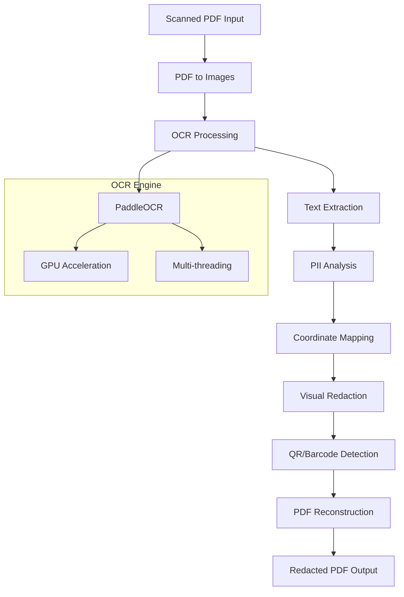

# 📄 Scanned PDF Processor

The `scanned_pdf_processor.py` module handles OCR-based processing of scanned PDF documents and image-based PDFs that require text extraction.

## Overview

This processor is specifically designed for PDFs that contain scanned pages or images rather than extractable text. It uses advanced OCR (Optical Character Recognition) technology to extract text and then applies PII detection and redaction.

## Architecture



## Key Features

### 🔍 **Advanced OCR Processing**

- **PaddleOCR Integration** - State-of-the-art multilingual OCR engine
- **GPU Acceleration** - CUDA support for 10x faster processing
- **Multi-threaded Processing** - Parallel page processing for performance
- **Timeout Protection** - Prevents hanging on problematic pages

### 📊 **Intelligent Text Detection**

- **Confidence Thresholding** - Configurable OCR confidence levels
- **Text Block Recognition** - Accurate bounding box detection
- **Language Support** - Optimized for English with multi-language capability
- **Image Preprocessing** - Enhances OCR accuracy

### 🎯 **Precise Redaction**

- **Coordinate Mapping** - Maps OCR coordinates to PDF coordinates
- **Visual Redaction** - Black boxes over sensitive content
- **QR/Barcode Detection** - Integrated QR code and barcode redaction
- **Font-aware Redaction** - Maintains document formatting

## Usage

### Basic Usage

```python
from Redactify.processors.scanned_pdf_processor import process_scanned_pdf

# Process a scanned PDF
result = process_scanned_pdf(
    input_path="scanned_document.pdf",
    output_path="redacted_document.pdf",
    pii_types=['PERSON', 'EMAIL_ADDRESS', 'PHONE_NUMBER'],
    presidio_analyzer=analyzer,
    progress_callback=lambda p: print(f"Progress: {p}%")
)

print(f"Redacted {result['total_entities_redacted']} PII entities")
print(f"Processing time: {result['processing_time_seconds']} seconds")
```

### Advanced Configuration

```python
# Custom OCR settings
ocr_config = {
    'use_angle_cls': True,  # Enable text angle classification
    'lang': 'en',          # Language (en, ch, fr, german, korean, japan)
    'use_gpu': True,       # Enable GPU acceleration
    'gpu_mem': 8000        # GPU memory limit in MB
}

result = process_scanned_pdf(
    input_path="document.pdf",
    output_path="redacted.pdf",
    pii_types=['INDIA_AADHAAR_NUMBER', 'INDIA_PAN_NUMBER'],
    presidio_analyzer=analyzer,
    ocr_config=ocr_config,
    confidence_threshold=0.7,  # Higher threshold for more accuracy
    detect_qr_barcodes=True,   # Enable QR/barcode detection
    debug_save_images=True     # Save intermediate images for debugging
)
```

## Core Functions

### `process_scanned_pdf()`

Main function for processing scanned PDF documents.

**Parameters:**

- `input_path` (str): Path to input PDF file
- `output_path` (str): Path for redacted output PDF
- `pii_types` (List[str]): PII types to detect and redact
- `presidio_analyzer`: Presidio analyzer instance
- `progress_callback` (callable, optional): Progress reporting function
- `confidence_threshold` (float): OCR confidence threshold (0.0-1.0)
- `detect_qr_barcodes` (bool): Enable QR/barcode detection
- `ocr_config` (dict, optional): Custom OCR configuration
- `debug_save_images` (bool): Save debug images

**Returns:**

- Dictionary with processing results and statistics

### `run_ocr_safely()`

Executes OCR processing with timeout protection and error handling.

**Parameters:**

- `ocr`: PaddleOCR instance
- `img_array`: Input image as numpy array

**Returns:**

- OCR results with text, confidence scores, and bounding boxes

### `convert_pdf_to_images()`

Converts PDF pages to high-resolution images for OCR processing.

**Parameters:**

- `pdf_path` (str): Path to PDF file
- `dpi` (int): Resolution for image conversion (default: 300)
- `first_page` (int, optional): First page to convert
- `last_page` (int, optional): Last page to convert

**Returns:**

- List of PIL Image objects

## Configuration

### OCR Settings

```yaml
# In config.yaml
ocr_confidence_threshold: 0.1  # Lower = more text detected
paddle_ocr_config:
  use_angle_cls: true         # Text angle classification
  lang: 'en'                  # Language detection
  use_gpu: true               # GPU acceleration
  gpu_mem: 8000              # GPU memory limit (MB)
  max_text_length: 25        # Maximum text length for detection
```

### Performance Settings

```yaml
# Processing configuration
max_concurrent_pages: 4      # Parallel page processing
ocr_timeout_seconds: 60      # Timeout per page
image_conversion_dpi: 300    # DPI for PDF to image conversion
debug_save_images: false     # Save intermediate images
```

## Performance Optimization

### GPU Acceleration

The processor automatically detects and utilizes GPU acceleration:

```python
# GPU resource management
with GPUResourceManager() as gpu_manager:
    if gpu_manager.is_gpu_available():
        ocr = PaddleOCR(use_gpu=True, gpu_mem=8000)
    else:
        ocr = PaddleOCR(use_gpu=False)
```

### Memory Management

- **Page-wise Processing** - Processes one page at a time to control memory usage
- **Garbage Collection** - Explicit cleanup of large image objects
- **Resource Monitoring** - Tracks memory usage and prevents OOM errors
- **Timeout Protection** - Prevents hanging on problematic pages

### Multi-threading

```python
# Parallel processing configuration
max_workers = min(4, os.cpu_count())  # Limit concurrent threads
with concurrent.futures.ThreadPoolExecutor(max_workers=max_workers) as executor:
    # Process multiple pages concurrently
    futures = [executor.submit(process_page, page) for page in pages]
```

## Error Handling

### Common Issues and Solutions

#### OCR Timeout Errors

```python
try:
    with time_limit(60):  # 60 second timeout
        ocr_result = ocr.ocr(image_array)
except TimeoutError:
    logging.warning(f"OCR timeout on page {page_num}")
    # Fall back to text-based processing or skip page
```

#### Memory Issues

```python
# Monitor memory usage
def check_memory_usage():
    memory_percent = psutil.virtual_memory().percent
    if memory_percent > 85:
        logging.warning(f"High memory usage: {memory_percent}%")
        gc.collect()  # Force garbage collection
```

#### GPU Memory Errors

```python
try:
    ocr = PaddleOCR(use_gpu=True, gpu_mem=8000)
except Exception as e:
    logging.warning(f"GPU initialization failed: {e}")
    ocr = PaddleOCR(use_gpu=False)  # Fall back to CPU
```

## Supported Formats

### Input Formats

- **PDF Files** - Scanned PDFs, image-based PDFs
- **Image PDFs** - PDFs containing embedded images
- **Mixed PDFs** - PDFs with both text and images

### Image Requirements

- **Resolution** - Minimum 150 DPI recommended (300 DPI optimal)
- **Color** - Supports color, grayscale, and black & white
- **Quality** - Clear, non-blurry text for best OCR results

## Integration Examples

### With Web Interface

```python
# In Flask route handler
@bp.route('/process_scanned', methods=['POST'])
def process_scanned_pdf_route():
    file = request.files['file']
    pii_types = request.form.getlist('pii_types')
    
    # Queue background task
    task = perform_scanned_pdf_redaction.delay(
        file_path=file.filename,
        pii_types=pii_types,
        progress_callback=update_progress
    )
    
    return jsonify({'task_id': task.id})
```

### With Celery Tasks

```python
# In services/tasks.py
@celery.task(bind=True)
def perform_scanned_pdf_redaction(self, file_path, pii_types):
    def progress_callback(percentage):
        self.update_state(
            state='PROGRESS',
            meta={'percentage': percentage}
        )
    
    result = process_scanned_pdf(
        input_path=file_path,
        output_path=f"redacted_{file_path}",
        pii_types=pii_types,
        presidio_analyzer=get_analyzer(),
        progress_callback=progress_callback
    )
    
    return result
```

## Debugging and Troubleshooting

### Debug Image Output

Enable debug image saving to analyze OCR processing:

```python
result = process_scanned_pdf(
    input_path="document.pdf",
    output_path="redacted.pdf",
    pii_types=['PERSON'],
    presidio_analyzer=analyzer,
    debug_save_images=True  # Saves images to temp_files/debug/
)
```

Debug images include:

- **Original page images** - Converted from PDF
- **OCR detection overlays** - Bounding boxes around detected text
- **PII detection highlights** - Markup showing detected PII entities
- **Final redacted images** - Result after redaction

### Logging Configuration

```python
import logging

# Enable detailed OCR logging
logging.getLogger('paddleocr').setLevel(logging.DEBUG)
logging.getLogger('Redactify.processors.scanned_pdf_processor').setLevel(logging.DEBUG)

# Monitor processing steps
logger = logging.getLogger(__name__)
logger.info(f"Starting OCR processing for {num_pages} pages")
logger.debug(f"OCR config: {ocr_config}")
```

### Performance Monitoring

```python
import time
import psutil

def monitor_processing():
    start_time = time.time()
    start_memory = psutil.virtual_memory().percent
    
    # Process document
    result = process_scanned_pdf(...)
    
    end_time = time.time()
    end_memory = psutil.virtual_memory().percent
    
    print(f"Processing time: {end_time - start_time:.2f} seconds")
    print(f"Memory usage change: {end_memory - start_memory:.1f}%")
    print(f"Pages per second: {result['pages_processed'] / (end_time - start_time):.2f}")
```

## Best Practices

### 1. **Input Optimization**

- Use high-quality scanned documents (300+ DPI)
- Ensure good contrast between text and background
- Avoid skewed or rotated pages when possible

### 2. **Performance Tuning**

- Enable GPU acceleration for large documents
- Adjust `max_concurrent_pages` based on available memory
- Use appropriate confidence thresholds for your use case

### 3. **Error Handling**

- Always implement timeout handling for OCR processing
- Monitor memory usage for large documents
- Provide fallback mechanisms for processing failures

### 4. **Security Considerations**

- Ensure temporary image files are cleaned up
- Use secure file paths for debug image output
- Validate input files before processing

---

## Technical Specifications

| Specification | Details |
|---------------|---------|
| **OCR Engine** | PaddleOCR (optimized for multilingual text) |
| **GPU Support** | CUDA-enabled NVIDIA GPUs |
| **Memory Usage** | 2-4GB per page (depending on resolution) |
| **Processing Speed** | 30-60 seconds per page (GPU), 60-120 seconds (CPU) |
| **Supported Languages** | English (primary), Chinese, French, German, Korean, Japanese |
| **Maximum File Size** | Limited by available memory and disk space |
| **Concurrent Processing** | Up to 4 pages simultaneously |

---

## Dependencies

### Core Dependencies

- `PaddleOCR` - OCR engine
- `pdf2image` - PDF to image conversion
- `PyMuPDF (fitz)` - PDF manipulation
- `Pillow (PIL)` - Image processing
- `OpenCV (cv2)` - Computer vision operations
- `numpy` - Numerical operations

### Optional Dependencies

- `paddlepaddle-gpu` - GPU acceleration support
- `CUDA Toolkit` - NVIDIA GPU support
- `cuDNN` - Deep learning GPU acceleration

### Installation

```bash
# Basic CPU installation
pip install paddleocr pdf2image PyMuPDF Pillow opencv-python numpy

# GPU acceleration (requires CUDA)
pip install paddlepaddle-gpu
```
