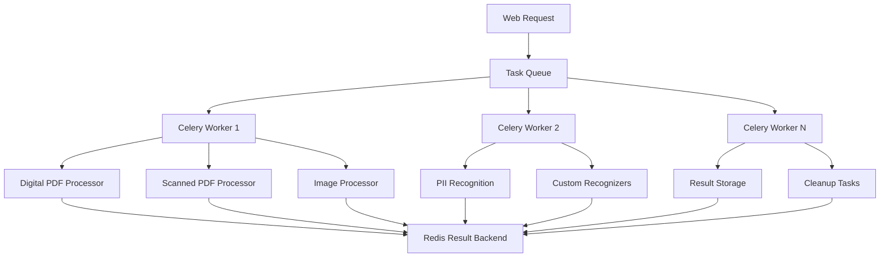

# ⚙️ Celery Service (celery_service.py)

<div align="center">


*Distributed task queue and background processing system*

</div>

---

## 📋 Overview

The `celery_service.py` module implements the distributed task queue system that powers Redactify's background processing capabilities. It manages document processing tasks, handles concurrent operations, and provides scalable processing architecture for PII redaction workflows.

## 🏗️ Architecture



## 🔧 Core Components

### 1. Celery Application Factory

```python
def make_celery(app):
    """Create Celery application with Flask app context."""
    
    celery = Celery(
        app.import_name,
        backend=app.config['CELERY_RESULT_BACKEND'],
        broker=app.config['CELERY_BROKER_URL'],
        include=['services.tasks']
    )
    
    # Update configuration
    celery.conf.update(app.config)
    
    # Ensure tasks run within Flask application context
    class ContextTask(celery.Task):
        def __call__(self, *args, **kwargs):
            with app.app_context():
                return self.run(*args, **kwargs)
    
    celery.Task = ContextTask
    return celery
```

**Logic Explanation:**

- **Flask Integration**: Ensures tasks have access to Flask app context
- **Configuration Inheritance**: Automatically inherits Flask configuration
- **Context Management**: Wraps tasks to maintain database connections and app state

### 2. Task Queue Configuration

```python
# Celery Configuration
CELERY_CONFIG = {
    # Broker settings
    'broker_url': 'redis://localhost:6379/0',
    'result_backend': 'redis://localhost:6379/0',
    
    # Task routing
    'task_routes': {
        'services.tasks.process_document': {'queue': 'high_priority'},
        'services.tasks.cleanup_files': {'queue': 'low_priority'},
        'services.tasks.generate_report': {'queue': 'default'},
    },
    
    # Worker configuration
    'worker_concurrency': 4,
    'worker_prefetch_multiplier': 1,
    'task_acks_late': True,
    'worker_disable_rate_limits': False,
    
    # Task execution
    'task_serializer': 'json',
    'accept_content': ['json'],
    'result_serializer': 'json',
    'timezone': 'UTC',
    'enable_utc': True,
    
    # Task time limits
    'task_soft_time_limit': 300,  # 5 minutes
    'task_time_limit': 600,       # 10 minutes hard limit
    
    # Result backend settings
    'result_expires': 3600,       # Results expire after 1 hour
    'result_persistent': True,
}
```

**Configuration Logic:**

- **Priority Queues**: Separates urgent tasks from background maintenance
- **Resource Management**: Controls worker concurrency and memory usage
- **Reliability**: Enables late acknowledgment for fault tolerance
- **Performance**: Optimizes serialization and prefetching

### 3. Task Monitoring and Health Checks

```python
class CeleryHealthCheck:
    """Monitor Celery worker health and performance."""
    
    def __init__(self, celery_app):
        self.celery = celery_app
        self.redis_client = redis.Redis.from_url(celery_app.conf.broker_url)
    
    def check_broker_connectivity(self):
        """Verify Redis broker is accessible."""
        try:
            self.redis_client.ping()
            return {'status': 'healthy', 'latency_ms': self.measure_latency()}
        except redis.ConnectionError as e:
            return {'status': 'unhealthy', 'error': str(e)}
    
    def check_worker_status(self):
        """Get active worker statistics."""
        inspect = self.celery.control.inspect()
        
        stats = {
            'active_workers': 0,
            'active_tasks': 0,
            'pending_tasks': 0,
            'failed_tasks': 0
        }
        
        # Get worker stats
        active_workers = inspect.active()
        if active_workers:
            stats['active_workers'] = len(active_workers)
            stats['active_tasks'] = sum(len(tasks) for tasks in active_workers.values())
        
        # Get queue lengths
        with self.redis_client.pipeline() as pipe:
            pipe.llen('celery')  # Default queue
            pipe.llen('high_priority')
            pipe.llen('low_priority')
            queue_lengths = pipe.execute()
        
        stats['pending_tasks'] = sum(queue_lengths)
        
        return stats
    
    def measure_latency(self):
        """Measure broker response time."""
        start_time = time.time()
        self.redis_client.ping()
        return round((time.time() - start_time) * 1000, 2)
```

### 4. Dynamic Worker Scaling

```python
class WorkerAutoscaler:
    """Automatically scale workers based on queue length."""
    
    def __init__(self, celery_app, min_workers=2, max_workers=10):
        self.celery = celery_app
        self.min_workers = min_workers
        self.max_workers = max_workers
        self.redis_client = redis.Redis.from_url(celery_app.conf.broker_url)
    
    def get_queue_pressure(self):
        """Calculate current queue pressure (0-1 scale)."""
        total_pending = 0
        
        # Check all queue lengths
        queues = ['celery', 'high_priority', 'low_priority']
        for queue in queues:
            total_pending += self.redis_client.llen(queue)
        
        # Calculate pressure based on pending tasks per worker
        active_workers = len(self.celery.control.inspect().active() or {})
        if active_workers == 0:
            return 1.0  # Maximum pressure if no workers
        
        tasks_per_worker = total_pending / active_workers
        return min(tasks_per_worker / 10, 1.0)  # Scale: 10+ tasks per worker = 100% pressure
    
    def scale_workers(self):
        """Adjust worker count based on queue pressure."""
        pressure = self.get_queue_pressure()
        current_workers = len(self.celery.control.inspect().active() or {})
        
        if pressure > 0.8 and current_workers < self.max_workers:
            # Scale up
            new_workers = min(current_workers + 2, self.max_workers)
            self.celery.control.pool_grow(n=new_workers - current_workers)
            logger.info(f"Scaled up to {new_workers} workers (pressure: {pressure:.2f})")
        
        elif pressure < 0.2 and current_workers > self.min_workers:
            # Scale down
            new_workers = max(current_workers - 1, self.min_workers)
            self.celery.control.pool_shrink(n=current_workers - new_workers)
            logger.info(f"Scaled down to {new_workers} workers (pressure: {pressure:.2f})")
```

## 🔄 Task Lifecycle Management

### 1. Task States and Transitions

```python
from celery import states

CUSTOM_STATES = {
    'INITIALIZING': 'Task is being initialized',
    'PROCESSING': 'Document is being processed',
    'RECOGNIZING': 'PII recognition in progress',
    'REDACTING': 'Applying redactions',
    'FINALIZING': 'Generating final output',
    'CLEANUP': 'Cleaning up temporary files'
}

def update_task_progress(task_id, state, progress=0, message=''):
    """Update task progress with custom state."""
    
    current_task.update_state(
        task_id=task_id,
        state=state,
        meta={
            'progress': progress,
            'message': message,
            'timestamp': datetime.utcnow().isoformat()
        }
    )
```

### 2. Error Handling and Retry Logic

```python
@celery.task(bind=True, autoretry_for=(Exception,), retry_kwargs={'max_retries': 3})
def robust_document_processor(self, file_path, options):
    """Document processor with intelligent retry logic."""
    
    try:
        # Task implementation
        result = process_document_internal(file_path, options)
        return result
        
    except MemoryError as exc:
        # Don't retry memory errors, they likely won't resolve
        logger.error(f"Memory error processing {file_path}: {exc}")
        raise self.retry(countdown=300, max_retries=1)
        
    except FileNotFoundError as exc:
        # Don't retry missing files
        logger.error(f"File not found: {file_path}")
        raise exc
        
    except Exception as exc:
        # Exponential backoff for other errors
        countdown = 2 ** self.request.retries
        logger.warning(f"Task failed, retrying in {countdown}s: {exc}")
        raise self.retry(countdown=countdown, exc=exc)
```

### 3. Resource Management

```python
class ResourceManager:
    """Manage system resources during task execution."""
    
    def __init__(self):
        self.memory_limit = psutil.virtual_memory().total * 0.8  # 80% of RAM
        self.cpu_limit = psutil.cpu_count() * 0.9  # 90% of CPU cores
    
    def check_resource_availability(self):
        """Check if system has enough resources for new tasks."""
        
        memory_usage = psutil.virtual_memory().percent
        cpu_usage = psutil.cpu_percent(interval=1)
        
        if memory_usage > 85:
            raise ResourceWarning(f"High memory usage: {memory_usage}%")
        
        if cpu_usage > 90:
            raise ResourceWarning(f"High CPU usage: {cpu_usage}%")
        
        return True
    
    def cleanup_resources(self):
        """Clean up system resources after task completion."""
        
        # Force garbage collection
        import gc
        gc.collect()
        
        # Clear GPU memory if available
        try:
            import torch
            if torch.cuda.is_available():
                torch.cuda.empty_cache()
        except ImportError:
            pass
```

## 📊 Performance Optimization

### 1. Task Chunking for Large Documents

```python
def chunk_large_document(file_path, chunk_size=50):
    """Split large documents into manageable chunks."""
    
    import fitz  # PyMuPDF
    
    doc = fitz.open(file_path)
    total_pages = len(doc)
    
    if total_pages <= chunk_size:
        return [file_path]  # No chunking needed
    
    chunks = []
    for start_page in range(0, total_pages, chunk_size):
        end_page = min(start_page + chunk_size, total_pages)
        
        # Create chunk document
        chunk_doc = fitz.open()
        chunk_doc.insert_pdf(doc, from_page=start_page, to_page=end_page-1)
        
        chunk_path = f"{file_path}.chunk_{start_page}_{end_page}.pdf"
        chunk_doc.save(chunk_path)
        chunks.append(chunk_path)
        
        chunk_doc.close()
    
    doc.close()
    return chunks

@celery.task
def process_document_chunks(file_path, options):
    """Process document in parallel chunks."""
    
    chunks = chunk_large_document(file_path)
    
    if len(chunks) == 1:
        return process_single_document(chunks[0], options)
    
    # Process chunks in parallel
    chunk_tasks = [
        process_single_document.delay(chunk, options) 
        for chunk in chunks
    ]
    
    # Collect results
    results = [task.get() for task in chunk_tasks]
    
    # Merge chunk results
    final_result = merge_chunk_results(results, file_path)
    
    # Cleanup chunk files
    for chunk in chunks:
        os.remove(chunk)
    
    return final_result
```

### 2. Caching and Memoization

```python
from functools import lru_cache
import hashlib

class TaskResultCache:
    """Cache task results to avoid reprocessing identical documents."""
    
    def __init__(self, redis_client):
        self.redis = redis_client
        self.cache_ttl = 3600  # 1 hour
    
    def get_file_hash(self, file_path):
        """Generate hash for file content."""
        hasher = hashlib.sha256()
        with open(file_path, 'rb') as f:
            for chunk in iter(lambda: f.read(4096), b""):
                hasher.update(chunk)
        return hasher.hexdigest()
    
    def get_cache_key(self, file_path, options):
        """Generate cache key for task."""
        file_hash = self.get_file_hash(file_path)
        options_hash = hashlib.md5(json.dumps(options, sort_keys=True).encode()).hexdigest()
        return f"redactify:cache:{file_hash}:{options_hash}"
    
    def get_cached_result(self, file_path, options):
        """Retrieve cached result if available."""
        cache_key = self.get_cache_key(file_path, options)
        cached_data = self.redis.get(cache_key)
        
        if cached_data:
            return json.loads(cached_data)
        return None
    
    def cache_result(self, file_path, options, result):
        """Cache task result."""
        cache_key = self.get_cache_key(file_path, options)
        self.redis.setex(
            cache_key, 
            self.cache_ttl, 
            json.dumps(result, default=str)
        )
```

## 🔐 Security and Compliance

### 1. Task Data Protection

```python
def secure_task_execution(func):
    """Decorator to ensure secure task execution."""
    
    @wraps(func)
    def wrapper(*args, **kwargs):
        # Validate input parameters
        for arg in args:
            if isinstance(arg, str) and ('..' in arg or arg.startswith('/')):
                raise SecurityError("Invalid file path detected")
        
        # Create isolated execution environment
        with tempfile.TemporaryDirectory() as temp_dir:
            # Copy input files to temporary location
            secure_args = []
            for arg in args:
                if isinstance(arg, str) and os.path.exists(arg):
                    secure_path = os.path.join(temp_dir, os.path.basename(arg))
                    shutil.copy2(arg, secure_path)
                    secure_args.append(secure_path)
                else:
                    secure_args.append(arg)
            
            # Execute task
            result = func(*secure_args, **kwargs)
            
            # Securely delete temporary files
            for file_path in glob.glob(os.path.join(temp_dir, '*')):
                secure_delete(file_path)
            
            return result
    
    return wrapper

def secure_delete(file_path):
    """Securely delete file by overwriting with random data."""
    if os.path.exists(file_path):
        file_size = os.path.getsize(file_path)
        with open(file_path, 'r+b') as f:
            f.write(os.urandom(file_size))
            f.flush()
            os.fsync(f.fileno())
        os.remove(file_path)
```

### 2. Audit Logging

```python
def log_task_execution(task_name, task_id, user_id=None, file_info=None):
    """Log task execution for audit purposes."""
    
    audit_entry = {
        'timestamp': datetime.utcnow().isoformat(),
        'task_name': task_name,
        'task_id': task_id,
        'user_id': user_id,
        'file_info': file_info,
        'worker_id': os.getenv('WORKER_ID', socket.gethostname()),
        'session_id': current_task.request.id if current_task else None
    }
    
    # Log to audit system
    audit_logger = logging.getLogger('audit')
    audit_logger.info(json.dumps(audit_entry))
    
    # Store in database for compliance
    from models import AuditLog
    AuditLog.create(**audit_entry)
```

---

**Next**: Review [`tasks.md`](../services/tasks.md) for background task implementations.
