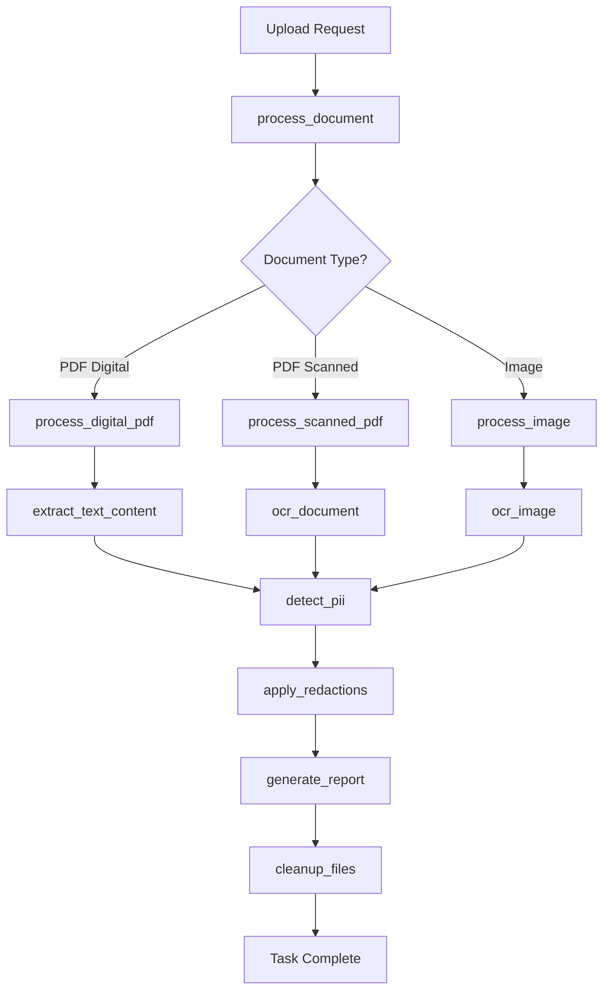

# 📋 Background Tasks (tasks.py)

<div align="center">


*Core background task implementations for document processing*

</div>

---

## 📋 Overview

The `tasks.py` module contains all Celery task definitions that handle the core business logic of PII redaction. These tasks are executed asynchronously in the background, allowing the web interface to remain responsive while processing large documents or handling multiple concurrent requests.

## 🏗️ Task Architecture



## 🔧 Core Task Definitions

### 1. Main Document Processing Task

```python
@celery.task(bind=True, name='process_document')
def process_document(self, file_path, options=None):
    """
    Main entry point for document processing.
    
    Args:
        file_path (str): Path to uploaded document
        options (dict): Processing configuration options
    
    Returns:
        dict: Processing results with redacted document path and statistics
    """
    
    # Initialize task progress
    self.update_state(
        state='INITIALIZING',
        meta={'progress': 0, 'message': 'Initializing document processing...'}
    )
    
    try:
        # Validate input file
        if not os.path.exists(file_path):
            raise FileNotFoundError(f"Document not found: {file_path}")
        
        # Determine document type and route to appropriate processor
        doc_type = detect_document_type(file_path)
        self.update_state(
            state='PROCESSING', 
            meta={'progress': 10, 'message': f'Detected document type: {doc_type}'}
        )
        
        # Route to specific processor
        if doc_type == 'pdf_digital':
            result = process_digital_pdf.delay(file_path, options).get()
        elif doc_type == 'pdf_scanned':
            result = process_scanned_pdf.delay(file_path, options).get()
        elif doc_type in ['jpg', 'png', 'tiff', 'bmp']:
            result = process_image.delay(file_path, options).get()
        else:
            raise ValueError(f"Unsupported document type: {doc_type}")
        
        # Generate processing report
        self.update_state(
            state='FINALIZING',
            meta={'progress': 90, 'message': 'Generating processing report...'}
        )
        
        report = generate_processing_report.delay(result).get()
        result['report'] = report
        
        # Schedule cleanup
        cleanup_files.delay(file_path, delay=3600)  # Cleanup after 1 hour
        
        self.update_state(
            state='SUCCESS',
            meta={'progress': 100, 'message': 'Document processing completed successfully'}
        )
        
        return result
        
    except Exception as exc:
        self.update_state(
            state='FAILURE',
            meta={'progress': 0, 'error': str(exc), 'traceback': traceback.format_exc()}
        )
        raise
```

**Logic Explanation:**

- **Progressive Updates**: Provides real-time progress feedback to users
- **Type Detection**: Automatically routes documents to appropriate processors
- **Error Handling**: Comprehensive error capture with detailed logging
- **Resource Management**: Schedules cleanup to prevent disk space issues

### 2. Digital PDF Processing

```python
@celery.task(bind=True, name='process_digital_pdf')
def process_digital_pdf(self, file_path, options=None):
    """
    Process digital PDF documents with extractable text.
    
    Args:
        file_path (str): Path to PDF file
        options (dict): Processing options
    
    Returns:
        dict: Processing results
    """
    
    try:
        from processors.digital_pdf_processor import DigitalPDFProcessor
        
        self.update_state(
            state='PROCESSING',
            meta={'progress': 20, 'message': 'Extracting text from PDF...'}
        )
        
        processor = DigitalPDFProcessor(options)
        
        # Extract text content with position information
        text_data = processor.extract_text_with_positions(file_path)
        
        self.update_state(
            state='RECOGNIZING',
            meta={'progress': 40, 'message': 'Analyzing content for PII...'}
        )
        
        # Detect PII in extracted text
        pii_results = detect_pii_in_text.delay(text_data).get()
        
        self.update_state(
            state='REDACTING',
            meta={'progress': 70, 'message': 'Applying redactions to PDF...'}
        )
        
        # Apply redactions to original PDF
        redacted_pdf_path = processor.apply_redactions(file_path, pii_results)
        
        # Calculate statistics
        stats = calculate_processing_stats(text_data, pii_results)
        
        return {
            'original_file': file_path,
            'redacted_file': redacted_pdf_path,
            'pii_detected': pii_results,
            'statistics': stats,
            'processing_time': time.time() - start_time
        }
        
    except Exception as exc:
        logger.error(f"Digital PDF processing failed: {exc}")
        raise
```

### 3. Scanned PDF Processing (OCR)

```python
@celery.task(bind=True, name='process_scanned_pdf')
def process_scanned_pdf(self, file_path, options=None):
    """
    Process scanned PDF documents using OCR.
    
    Args:
        file_path (str): Path to scanned PDF file
        options (dict): OCR and processing options
    
    Returns:
        dict: Processing results with OCR confidence scores
    """
    
    try:
        from processors.scanned_pdf_processor import ScannedPDFProcessor
        
        self.update_state(
            state='PROCESSING',
            meta={'progress': 20, 'message': 'Converting PDF pages to images...'}
        )
        
        processor = ScannedPDFProcessor(options)
        
        # Convert PDF pages to images
        page_images = processor.pdf_to_images(file_path)
        
        self.update_state(
            state='PROCESSING',
            meta={'progress': 30, 'message': f'Performing OCR on {len(page_images)} pages...'}
        )
        
        # Perform OCR on each page
        ocr_results = []
        for i, image in enumerate(page_images):
            page_progress = 30 + (40 * (i + 1) / len(page_images))
            self.update_state(
                state='PROCESSING',
                meta={'progress': page_progress, 'message': f'OCR processing page {i+1}/{len(page_images)}...'}
            )
            
            page_ocr = perform_ocr_on_image.delay(image, options).get()
            ocr_results.append(page_ocr)
        
        self.update_state(
            state='RECOGNIZING',
            meta={'progress': 70, 'message': 'Analyzing OCR results for PII...'}
        )
        
        # Detect PII in OCR text
        combined_text = combine_ocr_results(ocr_results)
        pii_results = detect_pii_in_text.delay(combined_text).get()
        
        self.update_state(
            state='REDACTING',
            meta={'progress': 85, 'message': 'Applying redactions to scanned PDF...'}
        )
        
        # Apply redactions using image coordinates
        redacted_pdf_path = processor.apply_image_redactions(file_path, page_images, pii_results)
        
        # Calculate OCR confidence and accuracy metrics
        stats = calculate_ocr_stats(ocr_results, pii_results)
        
        return {
            'original_file': file_path,
            'redacted_file': redacted_pdf_path,
            'ocr_results': ocr_results,
            'pii_detected': pii_results,
            'statistics': stats,
            'processing_time': time.time() - start_time
        }
        
    except Exception as exc:
        logger.error(f"Scanned PDF processing failed: {exc}")
        raise
```

### 4. Image Processing Task

```python
@celery.task(bind=True, name='process_image')
def process_image(self, file_path, options=None):
    """
    Process image files for PII detection and redaction.
    
    Args:
        file_path (str): Path to image file
        options (dict): Image processing options
    
    Returns:
        dict: Processing results
    """
    
    try:
        from processors.image_processor import ImageProcessor
        
        self.update_state(
            state='PROCESSING',
            meta={'progress': 20, 'message': 'Loading and preprocessing image...'}
        )
        
        processor = ImageProcessor(options)
        
        # Preprocess image for better OCR
        preprocessed_image = processor.preprocess_image(file_path)
        
        self.update_state(
            state='PROCESSING',
            meta={'progress': 40, 'message': 'Performing OCR on image...'}
        )
        
        # Perform OCR
        ocr_result = perform_ocr_on_image.delay(preprocessed_image, options).get()
        
        self.update_state(
            state='RECOGNIZING',
            meta={'progress': 60, 'message': 'Analyzing image content for PII...'}
        )
        
        # Detect PII in OCR text
        pii_results = detect_pii_in_text.delay(ocr_result['text']).get()
        
        self.update_state(
            state='REDACTING',
            meta={'progress': 80, 'message': 'Applying redactions to image...'}
        )
        
        # Apply redactions to image
        redacted_image_path = processor.apply_image_redactions(file_path, pii_results, ocr_result)
        
        # Generate statistics
        stats = calculate_image_stats(ocr_result, pii_results)
        
        return {
            'original_file': file_path,
            'redacted_file': redacted_image_path,
            'ocr_result': ocr_result,
            'pii_detected': pii_results,
            'statistics': stats,
            'processing_time': time.time() - start_time
        }
        
    except Exception as exc:
        logger.error(f"Image processing failed: {exc}")
        raise
```

## 🔍 PII Detection Tasks

### 1. Text Analysis Task

```python
@celery.task(bind=True, name='detect_pii_in_text')
def detect_pii_in_text(self, text_data, options=None):
    """
    Detect PII in extracted text using multiple recognition engines.
    
    Args:
        text_data (dict): Text content with position information
        options (dict): Detection configuration
    
    Returns:
        dict: Detected PII entities with confidence scores
    """
    
    try:
        from services.redaction import RedactionService
        
        redaction_service = RedactionService(options)
        
        # Use multiple detection engines for better accuracy
        detection_engines = [
            'presidio_analyzer',
            'custom_recognizers', 
            'pattern_matching',
            'ml_classifier'
        ]
        
        all_detections = {}
        total_engines = len(detection_engines)
        
        for i, engine in enumerate(detection_engines):
            progress = 20 + (60 * (i + 1) / total_engines)
            self.update_state(
                state='RECOGNIZING',
                meta={'progress': progress, 'message': f'Running {engine}...'}
            )
            
            detections = redaction_service.detect_with_engine(text_data, engine)
            all_detections[engine] = detections
        
        # Combine and deduplicate results
        final_results = redaction_service.combine_detection_results(all_detections)
        
        # Apply confidence scoring
        scored_results = redaction_service.calculate_confidence_scores(final_results)
        
        return {
            'entities': scored_results,
            'detection_engines': detection_engines,
            'total_entities': len(scored_results),
            'high_confidence': len([e for e in scored_results if e['confidence'] > 0.8]),
            'processing_time': time.time() - start_time
        }
        
    except Exception as exc:
        logger.error(f"PII detection failed: {exc}")
        raise
```

### 2. OCR Processing Task

```python
@celery.task(bind=True, name='perform_ocr_on_image')
def perform_ocr_on_image(self, image_path, options=None):
    """
    Perform OCR on image using PaddleOCR.
    
    Args:
        image_path (str): Path to image file
        options (dict): OCR configuration options
    
    Returns:
        dict: OCR results with text and bounding boxes
    """
    
    try:
        from paddleocr import PaddleOCR
        import cv2
        import numpy as np
        
        # Initialize OCR engine
        ocr_lang = options.get('ocr_language', 'en') if options else 'en'
        use_gpu = options.get('use_gpu', False) if options else False
        
        ocr = PaddleOCR(
            use_angle_cls=True,
            lang=ocr_lang,
            use_gpu=use_gpu,
            show_log=False
        )
        
        # Load and preprocess image
        image = cv2.imread(image_path)
        if image is None:
            raise ValueError(f"Could not load image: {image_path}")
        
        # Perform OCR
        ocr_results = ocr.ocr(image, cls=True)
        
        # Process results
        processed_results = {
            'text': '',
            'words': [],
            'confidence_scores': [],
            'bounding_boxes': []
        }
        
        for line in ocr_results[0] if ocr_results[0] else []:
            bbox, (text, confidence) = line
            
            processed_results['words'].append(text)
            processed_results['confidence_scores'].append(confidence)
            processed_results['bounding_boxes'].append(bbox)
            processed_results['text'] += text + ' '
        
        # Calculate overall confidence
        if processed_results['confidence_scores']:
            avg_confidence = sum(processed_results['confidence_scores']) / len(processed_results['confidence_scores'])
            processed_results['average_confidence'] = avg_confidence
        else:
            processed_results['average_confidence'] = 0.0
        
        processed_results['text'] = processed_results['text'].strip()
        
        return processed_results
        
    except Exception as exc:
        logger.error(f"OCR processing failed: {exc}")
        raise
```

## 📊 Utility Tasks

### 1. Report Generation

```python
@celery.task(bind=True, name='generate_processing_report')
def generate_processing_report(self, processing_result):
    """
    Generate comprehensive processing report.
    
    Args:
        processing_result (dict): Results from document processing
    
    Returns:
        dict: Detailed processing report
    """
    
    try:
        report = {
            'summary': {
                'total_entities_found': len(processing_result.get('pii_detected', {}).get('entities', [])),
                'processing_time': processing_result.get('processing_time', 0),
                'document_type': detect_document_type(processing_result.get('original_file', '')),
                'timestamp': datetime.utcnow().isoformat()
            },
            'entity_breakdown': {},
            'confidence_analysis': {},
            'recommendations': []
        }
        
        # Analyze detected entities
        entities = processing_result.get('pii_detected', {}).get('entities', [])
        
        # Group by entity type
        entity_types = {}
        confidence_scores = []
        
        for entity in entities:
            entity_type = entity.get('label', 'UNKNOWN')
            confidence = entity.get('confidence', 0)
            
            if entity_type not in entity_types:
                entity_types[entity_type] = 0
            entity_types[entity_type] += 1
            confidence_scores.append(confidence)
        
        report['entity_breakdown'] = entity_types
        
        # Calculate confidence statistics
        if confidence_scores:
            report['confidence_analysis'] = {
                'average_confidence': sum(confidence_scores) / len(confidence_scores),
                'min_confidence': min(confidence_scores),
                'max_confidence': max(confidence_scores),
                'high_confidence_count': len([s for s in confidence_scores if s > 0.8]),
                'low_confidence_count': len([s for s in confidence_scores if s < 0.5])
            }
        
        # Generate recommendations
        if report['confidence_analysis'].get('low_confidence_count', 0) > 0:
            report['recommendations'].append(
                "Some entities were detected with low confidence. Manual review recommended."
            )
        
        if report['summary']['total_entities_found'] == 0:
            report['recommendations'].append(
                "No PII entities detected. Consider running additional detection engines."
            )
        
        return report
        
    except Exception as exc:
        logger.error(f"Report generation failed: {exc}")
        raise
```

### 2. File Cleanup Task

```python
@celery.task(bind=True, name='cleanup_files')
def cleanup_files(self, *file_paths, delay=0):
    """
    Clean up temporary and processed files.
    
    Args:
        file_paths: Paths to files to be cleaned up
        delay (int): Delay in seconds before cleanup
    
    Returns:
        dict: Cleanup results
    """
    
    if delay > 0:
        time.sleep(delay)
    
    cleanup_results = {
        'cleaned_files': [],
        'failed_cleanups': [],
        'total_space_freed': 0
    }
    
    for file_path in file_paths:
        try:
            if os.path.exists(file_path):
                file_size = os.path.getsize(file_path)
                
                # Secure deletion for sensitive files
                if any(ext in file_path.lower() for ext in ['.pdf', '.jpg', '.png']):
                    secure_delete_file(file_path)
                else:
                    os.remove(file_path)
                
                cleanup_results['cleaned_files'].append(file_path)
                cleanup_results['total_space_freed'] += file_size
                
                logger.info(f"Cleaned up file: {file_path} ({file_size} bytes)")
                
        except Exception as exc:
            cleanup_results['failed_cleanups'].append({
                'file_path': file_path,
                'error': str(exc)
            })
            logger.error(f"Failed to cleanup file {file_path}: {exc}")
    
    return cleanup_results

def secure_delete_file(file_path):
    """Securely delete a file by overwriting with random data."""
    if os.path.exists(file_path):
        file_size = os.path.getsize(file_path)
        
        # Overwrite with random data
        with open(file_path, 'r+b') as f:
            f.write(os.urandom(file_size))
            f.flush()
            os.fsync(f.fileno())
        
        # Remove the file
        os.remove(file_path)
```

## 🔄 Task Orchestration

### 1. Workflow Coordination

```python
@celery.task(bind=True, name='process_batch_documents')
def process_batch_documents(self, file_paths, options=None):
    """
    Process multiple documents in parallel with coordination.
    
    Args:
        file_paths (list): List of document paths to process
        options (dict): Processing options
    
    Returns:
        dict: Batch processing results
    """
    
    try:
        batch_id = str(uuid.uuid4())
        total_files = len(file_paths)
        
        self.update_state(
            state='INITIALIZING',
            meta={
                'progress': 0, 
                'message': f'Starting batch processing of {total_files} documents...',
                'batch_id': batch_id
            }
        )
        
        # Create processing tasks
        document_tasks = []
        for i, file_path in enumerate(file_paths):
            task = process_document.delay(file_path, options)
            document_tasks.append({
                'task_id': task.id,
                'file_path': file_path,
                'task': task
            })
        
        # Monitor progress
        completed_tasks = []
        failed_tasks = []
        
        while len(completed_tasks) + len(failed_tasks) < total_files:
            for task_info in document_tasks:
                if task_info['task'].ready() and task_info not in completed_tasks + failed_tasks:
                    try:
                        result = task_info['task'].get()
                        completed_tasks.append({
                            'file_path': task_info['file_path'],
                            'result': result
                        })
                    except Exception as exc:
                        failed_tasks.append({
                            'file_path': task_info['file_path'],
                            'error': str(exc)
                        })
            
            # Update progress
            progress = ((len(completed_tasks) + len(failed_tasks)) / total_files) * 100
            self.update_state(
                state='PROCESSING',
                meta={
                    'progress': progress,
                    'message': f'Processed {len(completed_tasks)} of {total_files} documents...',
                    'completed': len(completed_tasks),
                    'failed': len(failed_tasks),
                    'batch_id': batch_id
                }
            )
            
            time.sleep(1)  # Check every second
        
        # Generate batch report
        batch_report = generate_batch_report(completed_tasks, failed_tasks, batch_id)
        
        return {
            'batch_id': batch_id,
            'total_files': total_files,
            'completed': len(completed_tasks),
            'failed': len(failed_tasks),
            'results': completed_tasks,
            'failures': failed_tasks,
            'batch_report': batch_report
        }
        
    except Exception as exc:
        logger.error(f"Batch processing failed: {exc}")
        raise
```

---

**Next**: Review [`redaction.md`](redaction.md) for core redaction service logic.
