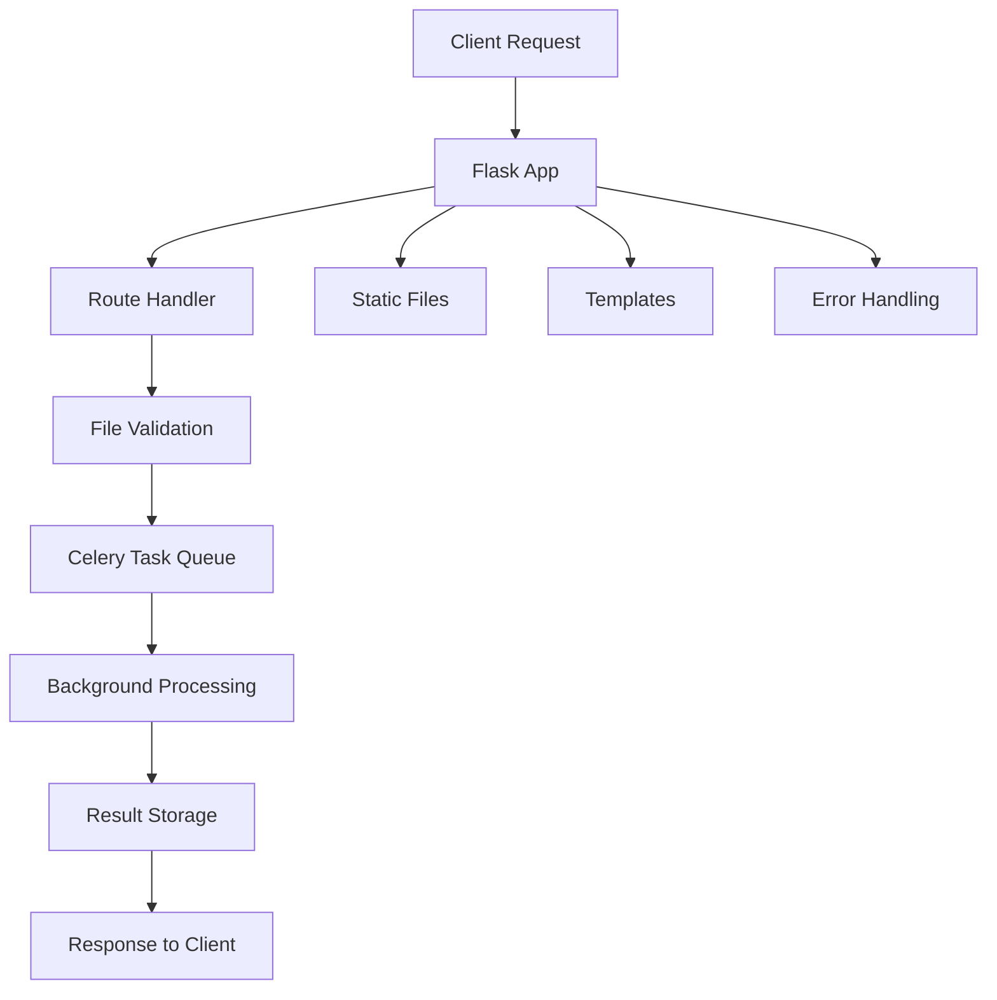

# 🌐 Flask Application (app.py)

<div align="center">


*Main Flask application setup and configuration*

</div>

---

## 📋 Overview

The `app.py` file serves as the main Flask application factory and configuration hub for the Redactify web interface. It orchestrates the entire web layer, manages routing, handles file uploads, and coordinates with the background task processing system.

## 🏗️ Architecture



## 🔧 Core Components

### 1. Application Factory Pattern

```python
def create_app(config_name='default'):
    app = Flask(__name__)
    app.config.from_object(config[config_name])
    
    # Initialize extensions
    celery.init_app(app)
    
    return app
```

**Logic Explanation:**

- Uses factory pattern for flexible configuration
- Supports multiple environments (development, production, testing)
- Lazy initialization of extensions prevents circular imports

### 2. File Upload System

**File Processing Pipeline:**

1. **Validation Layer**: Checks file type, size, and format
2. **Secure Storage**: Uses `werkzeug.secure_filename()`
3. **Metadata Extraction**: Gathers file information
4. **Task Queuing**: Submits to Celery for background processing

```python
@app.route('/upload', methods=['POST'])
def upload_file():
    # File validation
    if not allowed_file(file.filename):
        return jsonify({'error': 'Invalid file type'}), 400
    
    # Secure processing
    filename = secure_filename(file.filename)
    file_path = os.path.join(app.config['UPLOAD_FOLDER'], filename)
    
    # Queue for processing
    task = process_document.delay(file_path, options)
    return jsonify({'task_id': task.id})
```

### 3. Real-time Progress Tracking

**WebSocket Alternative Implementation:**

- Uses AJAX polling for progress updates
- Celery task states: PENDING → STARTED → SUCCESS/FAILURE
- Progress percentage calculation based on processing stages

### 4. Security Features

| Security Layer | Implementation | Purpose |
|----------------|----------------|---------|
| **CSRF Protection** | Flask-WTF tokens | Prevents cross-site attacks |
| **File Validation** | Extension whitelist | Blocks malicious uploads |
| **Secure Headers** | Custom middleware | Prevents XSS and clickjacking |
| **Rate Limiting** | Custom decorator | Prevents abuse |

## 🔄 Request Flow

1. **Static Routes** (`/`, `/about`, `/docs`)
   - Serve template pages
   - No authentication required
   - Cached for performance

2. **API Routes** (`/api/*`)
   - JSON responses only
   - Authentication middleware
   - Rate limiting applied

3. **Upload Routes** (`/upload`, `/process`)
   - File handling logic
   - Background task creation
   - Progress tracking setup

## ⚙️ Configuration Management

```python
class Config:
    SECRET_KEY = os.environ.get('SECRET_KEY') or 'dev-key'
    UPLOAD_FOLDER = os.environ.get('UPLOAD_FOLDER') or 'uploads'
    MAX_CONTENT_LENGTH = 16 * 1024 * 1024  # 16MB max file size
    
class DevelopmentConfig(Config):
    DEBUG = True
    CELERY_BROKER_URL = 'redis://localhost:6379/0'
    
class ProductionConfig(Config):
    DEBUG = False
    CELERY_BROKER_URL = os.environ.get('REDIS_URL')
```

**Configuration Logic:**

- Environment-based configuration switching
- Secure default values with environment overrides
- Production safety measures (debug disabled, secure keys)

## 🎨 Template System

### Template Hierarchy

```
templates/
├── base.html           # Common layout and navigation
├── index.html          # Landing page
├── upload.html         # File upload interface
├── progress.html       # Processing status
└── results.html        # Redaction results
```

### Key Features

- **Responsive Design**: Bootstrap 5 integration
- **Progressive Enhancement**: Works without JavaScript
- **Accessibility**: ARIA labels and semantic HTML
- **Internationalization**: Ready for multi-language support

## 📊 Performance Optimizations

1. **Static File Handling**
   - Nginx serves static files in production
   - CDN integration for global assets
   - Gzip compression enabled

2. **Database Connections**
   - Connection pooling with SQLAlchemy
   - Query optimization with eager loading
   - Background cleanup tasks

3. **Caching Strategy**
   - Redis for session storage
   - Template fragment caching
   - API response caching

## 🐛 Error Handling

```python
@app.errorhandler(404)
def not_found_error(error):
    return render_template('errors/404.html'), 404

@app.errorhandler(413)
def too_large_error(error):
    return jsonify({'error': 'File too large'}), 413

@app.errorhandler(500)
def internal_error(error):
    logger.error(f'Server Error: {error}')
    return render_template('errors/500.html'), 500
```

**Error Handling Strategy:**

- User-friendly error pages
- Comprehensive logging
- Graceful degradation
- Security-conscious error messages

## 🔧 Development Features

### Hot Reloading

- Flask development server auto-restart
- Template and static file watching
- Environment variable loading

### Debugging Tools

- Flask Debug Toolbar integration
- Request profiling middleware
- SQL query logging

## 🚀 Production Deployment

### WSGI Configuration

```python
# wsgi.py
from app import create_app

application = create_app('production')

if __name__ == "__main__":
    application.run()
```

### Gunicorn Setup

```bash
gunicorn --workers 4 --bind 0.0.0.0:8000 wsgi:application
```

## 📈 Monitoring Integration

- **Health Check Endpoint**: `/health` for load balancer monitoring
- **Metrics Collection**: Prometheus metrics export
- **Log Aggregation**: Structured JSON logging
- **Error Tracking**: Sentry integration for production

---

**Next**: Review [`main.md`](main.md) for application entry point logic.
