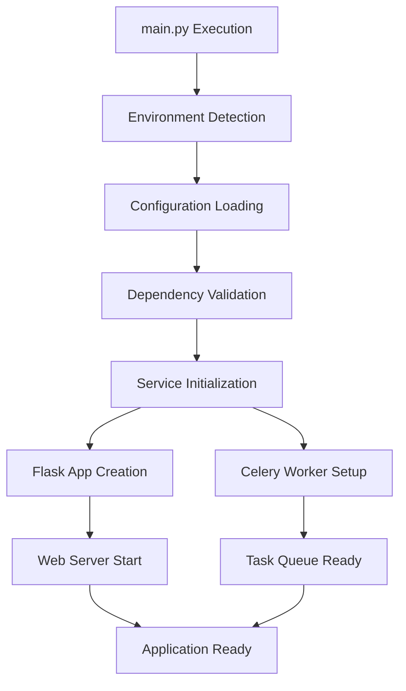

# 🚀 Main Entry Point (main.py)

<div align="center">


*Application bootstrap and initialization logic*

</div>

---

## 📋 Overview

The `main.py` file serves as the primary entry point for the Redactify application. It handles application initialization, environment setup, and coordinates the startup of both the web server and background task processing system.

## 🏗️ Bootstrap Architecture



## 🔧 Core Functionality

### 1. Environment Bootstrap

```python
def setup_environment():
    """Initialize application environment and dependencies."""
    
    # Load environment variables
    load_dotenv()
    
    # Validate required environment variables
    required_vars = ['SECRET_KEY', 'REDIS_URL', 'UPLOAD_FOLDER']
    missing_vars = [var for var in required_vars if not os.getenv(var)]
    
    if missing_vars:
        raise EnvironmentError(f"Missing required environment variables: {missing_vars}")
    
    # Create necessary directories
    os.makedirs(os.getenv('UPLOAD_FOLDER', 'uploads'), exist_ok=True)
    os.makedirs(os.getenv('RESULTS_FOLDER', 'results'), exist_ok=True)
    
    return True
```

**Logic Explanation:**

- **Environment Validation**: Ensures all required configuration is present
- **Directory Creation**: Sets up file system structure
- **Graceful Failure**: Provides clear error messages for missing dependencies

### 2. Dependency Checking

```python
def check_dependencies():
    """Verify all required dependencies are available."""
    
    dependencies = {
        'redis': lambda: redis.Redis().ping(),
        'presidio': lambda: import_module('presidio_analyzer'),
        'paddleocr': lambda: import_module('paddleocr'),
        'fitz': lambda: import_module('fitz'),  # PyMuPDF
    }
    
    for dep_name, check_func in dependencies.items():
        try:
            check_func()
            logger.info(f"✓ {dep_name} dependency available")
        except Exception as e:
            logger.error(f"✗ {dep_name} dependency failed: {e}")
            return False
    
    return True
```

**Dependency Validation Logic:**

- **Service Connectivity**: Tests Redis connection
- **Library Availability**: Verifies ML/AI libraries are installed
- **Graceful Degradation**: Provides fallback options where possible

### 3. Application Launcher

```python
def create_application():
    """Create and configure the Flask application."""
    
    from app import create_app
    from services.celery_service import make_celery
    
    # Determine environment
    env = os.getenv('FLASK_ENV', 'development')
    
    # Create Flask app
    app = create_app(env)
    
    # Initialize Celery
    celery = make_celery(app)
    
    return app, celery

def main():
    """Main application entry point."""
    
    # Setup and validation
    if not setup_environment():
        sys.exit(1)
    
    if not check_dependencies():
        logger.warning("Some dependencies missing - running in limited mode")
    
    # Create application
    app, celery = create_application()
    
    # Parse command line arguments
    parser = argparse.ArgumentParser(description='Redactify PII Redaction System')
    parser.add_argument('--mode', choices=['web', 'worker', 'both'], 
                       default='both', help='Application mode')
    parser.add_argument('--host', default='0.0.0.0', help='Host address')
    parser.add_argument('--port', type=int, default=5000, help='Port number')
    parser.add_argument('--workers', type=int, default=4, help='Number of workers')
    
    args = parser.parse_args()
    
    # Launch based on mode
    if args.mode in ['web', 'both']:
        start_web_server(app, args.host, args.port)
    
    if args.mode in ['worker', 'both']:
        start_celery_worker(celery, args.workers)
```

## 🔄 Startup Modes

### 1. Web Server Mode (`--mode web`)

```python
def start_web_server(app, host='0.0.0.0', port=5000):
    """Start the Flask web server."""
    
    if app.config['DEBUG']:
        # Development server
        app.run(host=host, port=port, debug=True, threaded=True)
    else:
        # Production server (requires gunicorn)
        from gunicorn.app.wsgiapp import WSGIApplication
        
        options = {
            'bind': f'{host}:{port}',
            'workers': multiprocessing.cpu_count() * 2 + 1,
            'worker_class': 'sync',
            'timeout': 300,
            'keepalive': 2,
        }
        
        WSGIApplication("%(prog)s [OPTIONS] [APP_MODULE]").run()
```

### 2. Worker Mode (`--mode worker`)

```python
def start_celery_worker(celery, concurrency=4):
    """Start Celery background workers."""
    
    worker = celery.Worker(
        loglevel='INFO',
        concurrency=concurrency,
        queues=['default', 'high_priority', 'low_priority']
    )
    
    worker.start()
```

### 3. Combined Mode (`--mode both`)

- Starts both web server and workers in separate processes
- Ideal for development and small deployments
- Production deployments typically use separate processes

## ⚙️ Configuration Handling

### Environment-Based Configuration

```python
CONFIG_MAP = {
    'development': {
        'DEBUG': True,
        'TESTING': False,
        'CELERY_ALWAYS_EAGER': False,
        'LOG_LEVEL': 'DEBUG'
    },
    'testing': {
        'DEBUG': False,
        'TESTING': True,
        'CELERY_ALWAYS_EAGER': True,
        'LOG_LEVEL': 'INFO'
    },
    'production': {
        'DEBUG': False,
        'TESTING': False,
        'CELERY_ALWAYS_EAGER': False,
        'LOG_LEVEL': 'WARNING'
    }
}
```

### GPU Detection and Setup

```python
def setup_gpu_acceleration():
    """Detect and configure GPU acceleration if available."""
    
    try:
        import torch
        if torch.cuda.is_available():
            device_count = torch.cuda.device_count()
            logger.info(f"GPU acceleration available: {device_count} devices")
            os.environ['CUDA_VISIBLE_DEVICES'] = ','.join(map(str, range(device_count)))
            return True
    except ImportError:
        pass
    
    logger.info("Running on CPU - consider GPU for better performance")
    return False
```

## 📊 Health Checks and Monitoring

### System Health Validation

```python
def perform_health_check():
    """Comprehensive system health check."""
    
    health_status = {
        'timestamp': datetime.utcnow().isoformat(),
        'status': 'healthy',
        'components': {}
    }
    
    # Check Redis connectivity
    try:
        redis_client = redis.Redis.from_url(os.getenv('REDIS_URL'))
        redis_client.ping()
        health_status['components']['redis'] = 'healthy'
    except Exception as e:
        health_status['components']['redis'] = f'unhealthy: {e}'
        health_status['status'] = 'degraded'
    
    # Check disk space
    upload_folder = os.getenv('UPLOAD_FOLDER', 'uploads')
    disk_usage = shutil.disk_usage(upload_folder)
    free_space_gb = disk_usage.free / (1024 ** 3)
    
    if free_space_gb < 1:  # Less than 1GB free
        health_status['components']['disk'] = f'low space: {free_space_gb:.2f}GB'
        health_status['status'] = 'warning'
    else:
        health_status['components']['disk'] = f'healthy: {free_space_gb:.2f}GB free'
    
    return health_status
```

## 🔧 Command Line Interface

### Available Commands

```bash
# Start web server only
python main.py --mode web --host 0.0.0.0 --port 8000

# Start workers only
python main.py --mode worker --workers 8

# Start both (development)
python main.py --mode both

# Production deployment
python main.py --mode web --host 0.0.0.0 --port 8000 --workers 4
```

### Docker Integration

```python
def detect_docker_environment():
    """Detect if running inside Docker container."""
    
    if os.path.exists('/.dockerenv'):
        return True
    
    try:
        with open('/proc/1/cgroup', 'r') as f:
            return 'docker' in f.read()
    except:
        return False

if detect_docker_environment():
    # Docker-specific configurations
    host = '0.0.0.0'  # Allow external connections
    port = int(os.getenv('PORT', 8000))
    workers = int(os.getenv('WEB_CONCURRENCY', multiprocessing.cpu_count()))
```

## 🚦 Graceful Shutdown

```python
def signal_handler(signum, frame):
    """Handle shutdown signals gracefully."""
    
    logger.info(f"Received signal {signum}, shutting down gracefully...")
    
    # Stop accepting new requests
    if hasattr(current_app, 'shutdown'):
        current_app.shutdown()
    
    # Complete ongoing tasks
    if celery_worker:
        celery_worker.stop()
    
    sys.exit(0)

# Register signal handlers
signal.signal(signal.SIGINT, signal_handler)
signal.signal(signal.SIGTERM, signal_handler)
```

## 📈 Performance Monitoring

### Application Metrics

```python
def setup_metrics():
    """Initialize performance monitoring."""
    
    from prometheus_client import Counter, Histogram, Gauge
    
    metrics = {
        'requests_total': Counter('requests_total', 'Total requests'),
        'request_duration': Histogram('request_duration_seconds', 'Request duration'),
        'active_tasks': Gauge('active_tasks', 'Active background tasks'),
        'memory_usage': Gauge('memory_usage_bytes', 'Memory usage')
    }
    
    return metrics
```

## 🐛 Error Handling and Recovery

### Application Recovery Logic

```python
def handle_startup_error(error):
    """Handle errors during application startup."""
    
    logger.error(f"Startup error: {error}")
    
    # Attempt recovery actions
    recovery_actions = [
        clear_temp_files,
        reset_redis_connections,
        validate_permissions,
    ]
    
    for action in recovery_actions:
        try:
            action()
            logger.info(f"Recovery action successful: {action.__name__}")
        except Exception as e:
            logger.warning(f"Recovery action failed: {action.__name__}: {e}")
    
    # If recovery fails, exit gracefully
    if not perform_health_check()['status'] == 'healthy':
        logger.critical("Unable to recover from startup error")
        sys.exit(1)
```

---

**Next**: Review [`routes.md`](routes.md) for API endpoint documentation.
